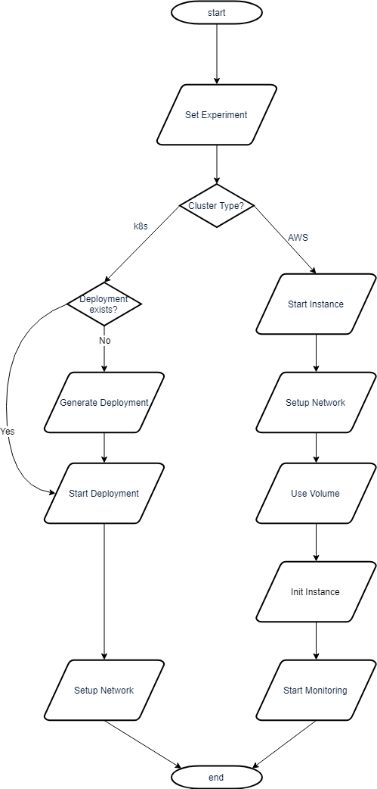

# Benchmark Experiment Host Manager
This Python tools helps **managing benchmark experiments of Database Management Systems (DBMS) in a High-Performance-Computing (HPC) cluster environment**.
It enables users to configure hardware / software setups for easily repeating tests over varying configurations.
The basic workflow is: start a virtual machine, install monitoring software and a database management system, import data, run benchmarks (external tool) and shut down everything with a single command.
A more advanced workflow is: Plan a sequence of such experiments, run plan as a batch and join results for comparison.
This tool supports AWS and kubernetes (k8s) based clusters.

This document
* illustrates the [concepts](#concepts)
* provides [basic examples](#basic-examples) including [how to configure an experiment setup](#how-to-configure-an-experiment-setup) and [how to address a cluster](#how-to-address-a-cluster)
  * [Example: TPC-H Benchmark for 3 DBMS on 1 Virtual Machine](#example-tpc-h-benchmark-for-3-dbms-on-1-virtual-machine)
  * [Example: TPC-H Benchmark for 1 DBMS on 3 Virtual Machines](#example-tpc-h-benchmark-for-1-dbms-on-3-virtual-machines)
* goes into more detail about the [API](#api-details), that is the commands for
  * [Run an Experiment](#run-experiment)
  * [Prepare an Experiment](#prepare-experiment)
  * [Start an Experiment](#start-experiment)
  * [Run Benchmarks](#run-benchmarks)
  * [Stop an Experiment](#stop-experiment)
  * [Clean an Experiment](#clean-experiment)

## Concepts

An **experiment** is a benchmark of a DBMS in a certain **host setting** and a specific **benchmark setting**.

A **host setting** consists of
* an instance (a virtual machine)
* a DBMS (as a docker image)
* a volume (containing some data)
* an init script (telling the dbms how to store the data)

A **benchmark setting** consists of
* a number of client processes
* a number of runs per connection
* a maximum timeout
* a lot more, depending on the [benchmark tool](https://github.com/Beuth-Erdelt/GEO-GPU-DBMS-Benchmarks)

### Workflow

The **management** roughly means
* [configure](#how-to-configure-an-experiment-setup), [set up](#example-setup-different-dbms-on-same-instance) and [start](#prepare-experiment) a virtual machine environment
* [start](#start-experiment) a DBMS and load raw data
* [run](#run-benchmarks) some benchmarks, fetch metrics and do reporting
* [shut](#stop-experiment) down environment and [clean up](#clean-experiment)

<p align="center">
    
</p>

In more detail this means
1. **Prepare Experiment**  
    1. **Start Virtual Machine**  
    AWS: Start Instance EC2  
    k8s: Create Deployment
    1. **Attach Network**  
    AWS: Attach EIP  
    k8s: Create Service, Port Forwarding  
    1. **Attach Data Storage Volume**  
    AWS: Attach and Mount EBS  
    k8s: Attach PVC  
    1. **Start Monitoring**  
    Start Prometheus Exporter Docker Container  
1. **Start Experiment**  
    1. Start DBMS Docker Container  
    Upload and run Init Scripts  
    Load Data from Data Storage Volume
1. **Run Benchmarks**  
1. **Report**  
    1. **Pull Logs**  
    From DBMS Container
    1. **Pull Metrics**  
    From Grafana Monitoring Server
1. **Stop Experiment**  
AWS: Stop DBMS Docker Container, Remove Docker Remnants
1. **Clean Experiment**  
AWS: Unmount and Detach EBS Volume, Detach EIP, Stop Instance EC2  
k8s: Stop Port Forwarding, Delete Deployment and Services

### Prerequisits

This tool relies on
* [dbms benchmarker](https://github.com/Beuth-Erdelt/DBMS-Benchmarker) for the actual benchmarks
* a [configuration file](#clusterconfig)
* [boto](http://boto.cloudhackers.com/en/latest/) for AWS management
* [paramiko](http://www.paramiko.org/) for SSH handling
* [scp](https://pypi.org/project/scp/) for SCP handling
* [kubernetes](https://github.com/kubernetes-client/python) for k8s management
* and some more [python libraries](https://github.com/perdelt/kubecluster/blob/master/requirements.txt)

## Basic examples

#### Files

This repository includes some basic examples as files:
* `template-cluster.config`: Demo of cluster configuration file
* `experiments/example/`: Demo of benchmark configuration files
  * `connection.config`: Empty list of (already processed) DBMS
  * `queries.config`: Configuration of queries of the experiment
  * `OmniSci/initschema.sql`: File of DDL commands of experiment
  * `OmniSci/initdata.sql`: File of ingestion commands of experiment
* `k8s/deploymenttemplate-PostgreSQL.yml`: Demo of DBMS deployment for k8s
* `experiment-example-AWS.py`: Demo of experiment workflow in AWS environment
* `experiment-example-k8s.py`: Demo of experiment workflow in k8s environment

We will explain this structure in the following.

#### How to address a cluster

* Load cluster config
* Set config for benchmarks
* For k8s: Set config for deployments

On **k8s**:

```
cluster = masterK8s.testdesign(clusterconfig='cluster.config', configfolder='experiments/tpch', yamlfolder='k8s/')
```

On **AWS**:

```
cluster = masterAWS.testdesign(clusterconfig='cluster.config', configfolder='experiments/tpch')
```

### Example: TPC-H Benchmark for 3 DBMS on 1 Virtual Machine

For running *TPC-H benchmarks of an OmniSci, a MariaDB and a PostgreSQL installation on an AWS instance*, we suggest the following folder structure:
```
./cluster.config
./experiments/tpch/queries.config
./experiments/tpch/MariaDB/initschema.sql
./experiments/tpch/MariaDB/initdata.sql
./experiments/tpch/OmniSci/initschema.sql
./experiments/tpch/OmniSci/initdata.sql
./experiments/tpch/PostgreSQL/initschema.sql
./experiments/tpch/PostgreSQL/initdata.sql
./experiment-tpch.py
```

This means we provide
* a [config file](#clusterconfig) containing cluster information, say `cluster.config`
* a [config folder](https://github.com/Beuth-Erdelt/GEO-GPU-DBMS-Benchmarks#config-folder) for the benchmark tool, say `experiments/tpch/`, containing a config file `queries.config` for TPC-H [queries](https://github.com/Beuth-Erdelt/DBMS-Benchmarker#query-file) and schema and ingestion commands per DBMS
* a python script managing the experiment workflow, say `experiment-tpch.py`

#### The Manager

`experiment-tpch.py` may contain
* Set data volume to `tpch`
* Set installation script to `1shard-SF1`
* Set instance to `1xK80`
* Run experiment on 3 different docker images

```
# set config
cluster = masterAWS.testdesign(clusterconfig='cluster.config', configfolder='experiments/tpch')

cluster.setExperiment(volume='tpch', script='1shard-SF1', instance='1xK80')
cluster.runExperiment(docker='OmniSci')
cluster.runExperiment(docker='MariaDB')
cluster.runExperiment(docker='MemSQL')
```

This is an abbreviation of

```
cluster.runExperiment(volume='tpch', docker='OmniSci', script='1shard-SF1', instance='1xK80')
cluster.runExperiment(volume='tpch', docker='MariaDB', script='1shard-SF1', instance='1xK80')
cluster.runExperiment(volume='tpch', docker='MemSQL', script='1shard-SF1', instance='1xK80')
```

If we do not want to restart the instance:

```
cluster = masterAWS.testdesign(clusterconfig='cluster.config', configfolder='experiments/tpch')

cluster.setExperiment(volume='tpch', script='1shard-SF1', instance='1xK80')
cluster.prepareExperiment()
cluster.startExperiment(docker='OmniSci')
cluster.runBenchmarks()
cluster.stopExperiment()
cluster.startExperiment(docker='MariaDB')
cluster.runBenchmarks()
cluster.stopExperiment()
cluster.startExperiment(docker='MemSQL')
cluster.runBenchmarks()
cluster.stopExperiment()
cluster.cleanExperiment()
```

### Example: TPC-H Benchmark for 1 DBMS on 3 Virtual Machines

For running *TPC-H benchmarks of an OmniSci installation on three AWS instances*, we suggest the following folder structure:
```
./cluster.config
./experiments/tpch/queries.config
./experiments/tpch/OmniSci/initschema.sql
./experiments/tpch/OmniSci/initdata.sql
./experiment-tpch.py
```

This means we provide
* a [config file](#clusterconfig) containing cluster information, say `cluster.config`
* a [config folder](https://github.com/Beuth-Erdelt/GEO-GPU-DBMS-Benchmarks#config-folder) for the benchmark tool, say `experiments/tpch/`, containing a config file `queries.config` for TPC-H [queries](https://github.com/Beuth-Erdelt/DBMS-Benchmarker#query-file) and schema and ingestion files for the DBMS
* a python script managing the experiment workflow, say `experiment-tpch.py`

#### The Manager

`experiment-tpch.py` may contain
* Set data volume to `tpch`
* Set docker image to `OmniSci`
* Set installation script to `1shard-SF1`
* Run experiment on 3 different instances

```
cluster = masterAWS.testdesign(clusterconfig='cluster.config', configfolder='experiments/tpch')

cluster.setExperiment(volume='tpch', docker='OmniSci', script='1shard-SF1')
cluster.runExperiment(instance='1xK80')
cluster.runExperiment(instance='4xK80')
cluster.runExperiment(instance='8xK80')
```

This is an abbreviation of

```
cluster.runExperiment(volume='tpch', docker='OmniSci', script='1shard-SF1', instance='1xK80')
cluster.runExperiment(volume='tpch', docker='OmniSci', script='1shard-SF1', instance='4xK80')
cluster.runExperiment(volume='tpch', docker='OmniSci', script='1shard-SF1', instance='8xK80')
```


## How to configure an experiment setup

We need
* a [config file](#clusterconfig) containing cluster information , say `cluster.config`
* a [config folder](https://github.com/Beuth-Erdelt/GEO-GPU-DBMS-Benchmarks#config-folder) for the benchmark tool, say `experiments/tpch/`, containing a config file `queries.config` for the [queries](https://github.com/Beuth-Erdelt/DBMS-Benchmarker#query-file)
* some additional data depending on if it is an [AWS](#on-aws) or a [k8s](#on-k8s) cluster
* a python script managing the experimental workflow, say `experiment-tpch.py`

### Clusterconfig

The configuration of the cluster, that is the possible host settings, consists of these parts (see also [example](template-cluster.config) config file):

**Result folder** for the benchmark tool:
```
'benchmarker': {
    'resultfolder': '/benchmarks' # Local path to results folder of benchmark tool
},
```

Information about the **volumes** containing the raw data for the DBMS to import. We also set a named list of **import scripts** per data set:
```
'volumes': {
    'tpch': { # Volume: Name
        'initscripts': { 
            '1shard-SF1': [ # Init Script: Name
                'initschema-tpch.sql',
                'initdata-tpch-SF1.sql'
            ],
            '4shard-SF1': [ # Init Script: Name
                'initschema-tpch-4shards.sql',
                'initdata-tpch-SF1.sql'
            ],
        }
    },
    'gdelt': { # Volume: Name
        'initscripts': {
            '1shard': [ # Init Script: Name
                'initschema-gdelt.sql',
                'initdata-gdelt.sql'
            ],
            '4shard-time': [ # Init Script: Name
                'initschema-gdelt-4shards.sql',
                'initdata-gdelt.sql'
            ],
        }
    }
},
```

Information about the **DBMS** to use:
```
'dockers': {
    'OmniSci': {
        'loadData': 'bin/omnisql -u admin -pHyperInteractive < {scriptname}', # DBMS: Command to Login and Run Scripts
        'template': { # Template for Benchmark Tool
            'version': 'CE v4.7',
            'alias': '',
            'JDBC': {
                'driver': 'com.omnisci.jdbc.OmniSciDriver',
                'url': 'jdbc:omnisci:{serverip}:9091:omnisci',
                'auth': {'user': 'admin', 'password': 'HyperInteractive'},
                'jar': 'omnisci-jdbc-4.7.1.jar' # DBMS: Local Path to JDBC Jar
            }
        },
        'logfile': '/omnisci-storage/data/mapd_log/omnisci_server.INFO', # DBMS: Path to Log File on Server
        'priceperhourdollar': 0.0,
    }
}
```
This requires
* a base name for the DBMS
* a prepared docker image of the DBMS
  * with an open port for a JDBC connection
* a placeholder `template` for the benchmark tool
* the JDBC driver jar locally available
* a command running the init scripts with `{scriptname}` as a placeholder for the script name inside the container
* `{serverip}` as a placeholder for the host address (localhost for k8s, an Elastic IP for AWS)
* an optional `priceperhourdollar`

#### On k8s

We need to add to the config file
```
'credentials': {
    'k8s': {
        'namespace': 'mynamespace', # K8s: Namespace of User
        'clustername': 'My_k8s_cluster', # K8s: Name of Cluster (just for annotation)
        'appname': 'dbmsbenchmarker', # K8s: To find corresponding deployments etc labels: app:
        'port': 9091 # K8s: Local port for connecting via JDBC after port forwarding
    }
}
```
This will tell the tool how to adress the cluster. An access token has to be installed at `~/.kube/config` with the corresponding `namespace` and all deployments, services, pods and pvcs of this tool will be recognized by
```
metadata:
  labels:
    app: dbmsbenchmarker
```

We also need to add for each DBMS which port we have to forward
```
'dockers': {
    'OmniSci': {
        'port': 3306, # k8s: remote port of the DBMC for connecting via JDBC
    }
}
```

For the deployments we either need yaml files containing all necessary information, i.e.
* Deployment with container information
* Service for networking
* PVC for local storage

or we need a template yaml file, c.f. [how to generate deployments](#prepare-experiment) and an [example](https://github.com/perdelt/kubecluster/blob/master/benchmarker/k8s/deploymenttemplate-OmniSci.yml).

#### On AWS


We additionally need
```
'credentials': {
    'AWS': {
        'AWS_Access_Key_ID': '', # AWS Access: Key ID
        'AWS_Secret_Access_Key': '', # AWS Access: Secret Access Key
        'Default_region': 'eu-central-1', # AWS Access: Default region
        'monitor': {
            'grafanatoken': 'Bearer 46363756756756476754756745', # Grafana: Access Token
            'grafanaurl': 'http://127.0.0.1:3000/api/datasources/proxy/1/api/v1/', # Grafana: API URL
        },
        'worker': {
            'ip': '127.1.2.3', # Elastic IP: IP Address
            'allocid': 'eipalloc-1234512345', # Elastic IP: Allocation ID
            'ppk': 'cluster.pem', # SSH: Local path to private key for acccessing instances in AWS cluster
            'username': 'ubuntu', # SSH: User name 
        },
    }
}
```
and for each volume an AWS Volume ID
```
'volumes': {
    'tpch': { # Volume: Name
        'id': 'vol-1234512345', # AWS Volume ID
    },
    'gdelt': { # Volume: Name
        'id': 'vol-9876987655', # AWS Volume ID
    }
},
```
and for each instance some basic information
```
'instances': {
    '1xK80': { # Instance: Name
        'id': 'i-918273764645', # Instance: Id
        'type': 'p2.xlarge', # Instance: Type
        'priceperhourdollar': 1.326, # Instance: Price per hour (on demand)
        'device': 'sdf', # Instance: Device name ec2volume.attach_to_instance(/dev/$device)
        'deviceMount': 'xvdf', # Instance: Device mount name - 'sudo mount /dev/$deviceMount /data'
        'RAM': '64G', # Instance: RAM
        'GPU': '1xK80' # Instance: GPUs
    },
    '8xK80': { # Instance: Name
        'id': 'i-192838475655', # Instance: Id
        'type': 'p2.8xlarge', # Instance: Type
        'priceperhourdollar': 10.608, # Instance: Price per hour (on demand)
        'device': 'sdf', # Instance: Device name ec2volume.attach_to_instance(/dev/$device)
        'deviceMount': 'xvdf', # Instance: Device mount name - 'sudo mount /dev/$deviceMount /data'
        'RAM': '480G', # Instance: RAM
        'GPU': '8xK80' # Instance: GPUs
    },
},
```
and for each DBMS the image source and docker command
```
'dockers': {
    'OmniSci': {
        'image': 'eu-central-1.amazonaws.com/myrepository/dbms:omnisci', # ECR: Path to DBMS Docker Image
        'start': 'docker run -d --runtime=nvidia --name benchmark -p 6273:6273 -p 6275-6280:6275-6280 -p 9091:6274 -v /data:/data/ ', # Docker: Part of Command to Start Container
    }
}
```

This requires
* A managing host having access to AWS
  * typically this means an `~/.aws` directory with config and credentials files
* EC2 instances as experiment hosts having
  * aws cli installed
  * docker installed
  * required ports open
* EIP for attaching to the current experiment host
* EBS volumes containing raw data
* ECR for simple docker registry

## API Details

### Run Experiment

<p align="center">
    
</p>

The command `cluster.runExperiment()` is short for:
```
cluster.prepareExperiment(instance, volume, docker, script)
cluster.startExperiment()
cluster.runBenchmarks()
cluster.stopExperiment()
cluster.cleanExperiment()
```

### Prepare Experiment
This yields a virtual machine with a fixed IP address and a fixed data folder: `/data`.
In a k8s cluster, this also starts the DBMS.


<p align="center">
    
</p>

#### On K8s

The command `cluster.prepareExperiment()` (basically) is short for:
```
cluster.setExperiment(instance, volume, docker, script)
cluster.createDeployment()
cluster.startPortforwarding()
```
* `cluster.createDeployment()`: Creates a deployment of a docker image (pod and services) to k8s  
The deployment is expected to be given as a file named `'deployment-'+docker+'-'+instance+'.yml'`  
If no such file exists, a file named `'deploymenttemplate-"+docker+".yml'` is loaded and
  * the instance name is understood as `cpu-mem-gpu-node`
  * the yaml file is changed as
  ```  
  dep['spec']['template']['spec']['containers'][0]['resources']['requests']['cpu'] = cpu  
  dep['spec']['template']['spec']['containers'][0]['resources']['limits']['cpu'] = cpu  
  dep['spec']['template']['spec']['containers'][0]['resources']['requests']['memory'] = mem  
  dep['spec']['template']['spec']['containers'][0]['resources']['limits']['memory'] = mem  
  dep['spec']['template']['spec']['nodeSelector']['gpu'] = node  
  dep['spec']['template']['spec']['containers'][0]['resources']['limits']['nvidia.com/gpu'] = int(gpu)
   ```
   * saved as `'deployment-'+docker+'-'+instance+'.yml'`
* Setup Network `cluster.startPortforwarding()`: Forwards the port of the DBMS in the pod to localhost:fixedport (same for all containers) 

#### On AWS

The command `cluster.prepareExperiment()` (basically) is short for:
```
cluster.setExperiment(instance, volume, docker, script)
cluster.startInstance()
cluster.attachIP()
cluster.connectSSH()
cluster.attachVolume()
cluster.initInstance()
cluster.startMonitoring()
cluster.mountVolume()
```

* `cluster.startInstance()`: Starts an instance (AWS EC2 - Virtual Machine)
* Setup Network `cluster.attachIP()`: Attaches a fixed IP (AWS Elastic IP), same for every instance
* `cluster.connectSSH()`: Connects to instance via SSH
* `cluster.attachVolume()`: Attaches a data volume (AWS EBS)
* `cluster.initInstance()`: Logs into necessary services, for example a docker hub (AWS ECR)
* `cluster.startMonitoring()`: Starts monitoring
* `cluster.mountVolume()`: Mounts the attached volume as `/data`

### Start Experiment

This yields a fully loaded DBMS with a fixed port on the virtual machine in a docker container with the fixed name `benchmark` (AWS) or a pod with the fixed label `app=` (k8s) resp.

<p align="center">
    
</p>

#### On K8s

The command `cluster.startExperiment()` (basically) is short for:
```
cluster.getInfo()
status = cluster.getPodStatus(self.activepod)
while status != "Running":
    print(status)
    cluster.wait(10)
    status = cluster.getPodStatus(self.activepod)
dbmsactive = cluster.checkDBMS(cluster.host, 9091)
while not dbmsactive:
    cluster.startPortforwarding()
    cluster.wait(10)
    dbmsactive = cluster.checkDBMS(cluster.host, 9091)
self.loadData()
```
* `cluster.getPodStatus()`: Checks status of pod (if pod is running)
* Setup Network `cluster.startPortforwarding()`: Forwards the port of the DBMS in the pod to localhost:fixedport (same for all containers) 
* `cluster.checkDBMS(ip, port)`: Opens a socket to localhost:port to check if dbms is answering
* `cluster.loadData()`: Uploads and runs init scripts to load data to dbms

We check the pod and the network connection again, since the pod may have changed due to restart.

#### On AWS

The command `cluster.startExperiment()` (basically) is short for:
```
cluster.setExperiment(instance, volume, docker, script)
cluster.startDocker()
dbmsactive = cluster.checkDBMS(cluster.host, port)
while not dbmsactive:
    cluster.wait(10)
    dbmsactive = cluster.checkDBMS(cluster.host, port)
cluster.loadData()
```

* `cluster.startDocker()`: Starts a docker container of a dbms
* `cluster.checkDBMS(ip, port)`: Opens a socket to ip:port to check if dbms is answering
* `cluster.loadData()`: Uploads and runs init scripts to load data to dbms

### Run Benchmarks

The command `cluster.runBenchmarks()` runs an [external benchmark tool](https://github.com/Beuth-Erdelt/GEO-GPU-DBMS-Benchmarks).

<p align="center">
    
</p>

This tool provides the benchmark tool information about the installed experiment host.
This information is packed into a so called connection, which is identified by it's name.  
The default connection name is given as `cluster.docker+"-"+cluster.script+"-"+cluster.instance+'-'+cluster.name`.  
Example: `OmniSci-1s-SF10-1xK80-AWS`

It is also possible to set an manual name, for example to include a timestamp or more information about the client setting:
```
connectionname = cluster.getConnectionName()
cluster.runBenchmarks(connection=connectionname+"-2clients")
```

Simulated clients can optionally be configured via a connection manager:
```
cluster.connectionmanagement['numProcesses'] = 8
cluster.connectionmanagement['runsPerConnection'] = 5
cluster.connectionmanagement['timeout'] = 1200
```
For more information about that, please consult the docs of the benchmark tool: https://github.com/Beuth-Erdelt/DBMS-Benchmarker#connection-file

Some information is given by configuration (JDBC data e.g.), some is collected from the experiment host:
```
cluster.getMemory()
cluster.getCPU()
cluster.getCores()
cluster.getHostsystem()
cluster.getDiskSpaceUsed()
cluster.getCUDA()
cluster.getGPUs()
cluster.copyInits()
cluster.copyLog()
cluster.downloadLog()
```

Most of these run inside the docker container:
* `cluster.getMemory()`: Collects `grep MemTotal /proc/meminfo | awk '{print $2}'` and multiplies by 1024
* `cluster.getCPU()`: Collects `cat /proc/cpuinfo | grep \'model name\' | head -n 1`
* `cluster.getCores()`: Collects `grep -c ^processor /proc/cpuinfo`
* `cluster.getHostsystem()`: Collects `uname -r`
* `cluster.getDiskSpaceUsed()`: Collects `df -h / | awk 'NR == 2{print $3}'`
* `cluster.getCUDA()`: Collects `nvidia-smi | grep \'CUDA\'`
* `cluster.getGPUs()`: Collects `nvidia-smi -L` and then aggregates the type using `Counter([x[x.find(":")+2:x.find("(")-1] for x in l if len(x)>0])`
* `cluster.copyInits()`: Copy init scripts to benchmark result folder on host
* `cluster.copyLog()`: Copy dbms logs to benchmark result folder on host
* `cluster.downloadLog()`: Downloads the benchmark result folder from host to local result folder

The external tool also does the reporting, and it uses these informations among others.

### Stop Experiment

This yields the virtual machine in (almost) the same state as if it was just prepared without restarting it.

<p align="center">
    
</p>

#### On K8s

The command `cluster.stopExperiment()` (basically) is short for:

```
cluster.getInfo()
cluster.stopPortforwarding()
for p in cluster.pods:
    cluster.deletePod(p)
```

* `cluster.stopPortforwarding()`: Disconnects network from current pod
* `cluster.deletePod()`: Deletes all pods belonging to namespace / matching label app. Note that the deployment will automatically start a new (clean) pod. Also note that the pod nevertheless will keep data if the storage device has been mounted.


#### On AWS

The command `cluster.stopExperiment()` (basically) is short for:
```
cluster.connectSSH()
cluster.stopDocker()
cluster.removeDocker()
cluster.cleanDocker()
```

* `cluster.stopDocker()`: Stops docker container of dbms (`docker stop benchmark`)
* `cluster.removeDocker()`: Removes docker container of dbms (`docker rm benchmark`)
* `cluster.cleanDocker()`: Cleans used space (`docker volume rm $(docker volume ls -qf dangling=true)`)

### Clean Experiment

This removes everything from the virtual machine that is related to the experiment (except for results) and shuts it down.

<p align="center">
    
</p>

#### On K8s

The command `cluster.cleanExperiment()` (basically) is short for:
```
cluster.stopPortforwarding()
for p in self.pvcs:
    self.deletePVC(p)
for s in cluster.services:
    cluster.deleteService(s)
for d in cluster.deployments:
    cluster.deleteDeployment(d)
for p in cluster.pods:
    status = cluster.getPodStatus(cluster.activepod)
    while status != "":
        print(status)
        time.sleep(5)
        status = cluster.getPodStatus(cluster.activepod)
```

* `cluster.stopPortforwarding()`: Kills all processes starting with `kubectl port-forward` on the client system
* `cluster.deletePVC()`: Deletes all PVCs in the current namespace and with fitting label app
* `cluster.deleteService()`: Deletes all Services in the current namespace and with fitting label app
* `cluster.deleteDeployment()`: Deletes all Deployments in the current namespace and with fitting label app

#### On AWS

The command `cluster.cleanExperiment()` (basically) is short for:
```
cluster.unmountVolume()
cluster.detachVolume()
cluster.stopInstance()
```

* `cluster.unmountVolume()`: Unmounts device
* `cluster.detachVolume()`: Detaches data storage volume
* `cluster.stopInstance()`: Stops the instance


