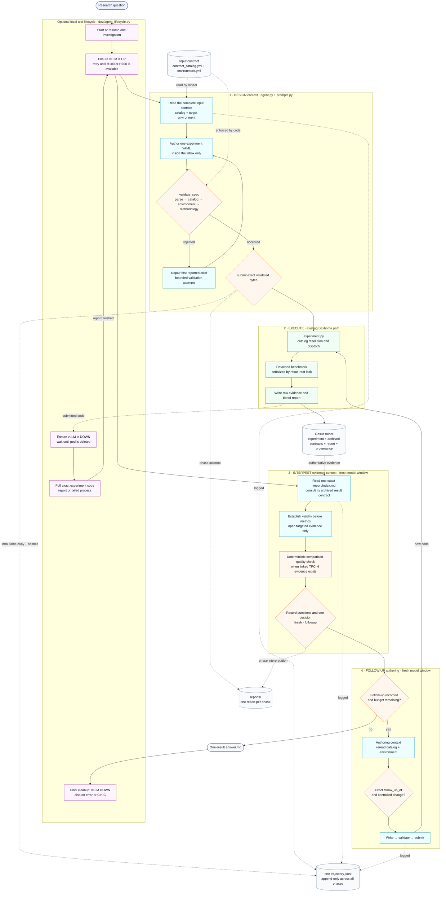

# Contract-driven benchmark agent

This is the complete description of the prototype pipeline: its two contracts,
phase and context boundaries, tools, deterministic enforcement, optional local
lifecycle wrapper, replay rules, evidence, and known limits. For commands only,
see [README.md](README.md).

The prototype demonstrates a bounded autonomous experimenter, not a general
agent framework. Its implemented catalog slice is TPC-H with PostgreSQL and
PgDuckDB, and YCSB with PostgreSQL. Bexhoma executes experiments through its
normal entry point; agent
policy remains in `agent/`.

## Annotated end-to-end flow



The purple lifecycle lane is local operator automation. It is not visible to
the model, imported by the agent, or required by the paper prototype. Without
it, an operator or scheduler invokes the same durable phases separately.

## The two-sided contract

The input side defines what may be run. The output side defines what may be
concluded.

| Side | Authoritative artifacts | Guarantee |
|---|---|---|
| Design | `contracts/contract_catalog.yml`, `dev/catalog/environment.yml` | Legal schema, supported workloads/systems/knobs, experimental guidance, node and storage availability, resource ceilings |
| Result | Archived `contract_result.yml`, `report/index.md`, linked evidence and raw provenance | Result layout, validity checks, metric meanings, identifiers, versions, and interpretation rules |

Prompts contain role, phase, tools, budgets, and stopping conditions. Domain and
deployment facts remain in files the model must read, which makes contract
consultation measurable in the trajectory.

## Runtime sequence and modules

| Step | Code used | Responsibility and durable output |
|---|---|---|
| CLI setup | `agent/harness/agent.py::main` | Creates one investigation at design; later phases reopen it and append to its trajectory |
| Model exchange | `model_client.py::ChatModel` | Calls an OpenAI-compatible endpoint; parses tool calls; logs but does not replay reasoning |
| Design instructions | `prompts.py::design_messages` | Requires contract reads, one attributable design, validation, and submission |
| Tool boundary | `tools.py::Workspace` | Canonical read/write scopes; complete-file writes; structured tool errors |
| Agent validation | `validation.py::validate_spec` | Shape, catalog, environment, and methodology checks; expanded run count and conservative declared-timeout budget |
| Shared resolution | `bexhoma/spec.py` | Existing profile, override, quantity, environment, and command resolution |
| Submission | `tools.py::submit`, `submit.py` | Full catalog-and-environment fingerprint check, immutable provenance snapshot, code allocation, result-root lock, agent-side catalog launch adapter, and result-folder archive |
| Execution | Bexhoma workload and lifecycle modules | Workload execution, optional per-configuration loading deadline, diagnostics-before-teardown, raw files, validity results, and tiered report |
| State recovery | `agent.py::_carry_forward` | Rebuilds the question, exact current specification, code, and budget from trajectory data without carrying an earlier result into interpretation |
| Evidence interpretation | `prompts.py::interpret_messages`, `agent.py::_InterpretationGate` | Selects one exact report; requires its Tests evidence and result contract; verifies failed-check count, affected phase scope, cited read paths, typed result claims, and one finish/follow-up decision |
| Deterministic comparison | `tools.py::assess_comparison_quality` | Reports query coverage where applicable, throughput comparability, repetition-anomaly warnings, and checkable factor results without relying on model arithmetic or workload names |
| Follow-up authoring | `prompts.py::followup_author_messages`, `agent.py::_author_followup` | Fresh mutation context; receives compact ancestor summaries, rereads the design contract, and enforces the current experiment code as lineage, a material controlled change, and any approved query subset before shared validation |
| Portable lineage summary | `agent.py::_write_agent_summary`, `contracts/contract_result.yml` | Persists one experiment code, parent, hypothesis, scientific verdict, technical validity, and unresolved question without copying ancestor reports into context |
| Design-space gate | `agent.py::_DesignSpaceGate` | Refuses initial or follow-up authoring until that context has reread the catalog and environment |
| Local automation | `dev/agent_lifecycle.py`, `dev/model_server.sh` | Optional vLLM switching, result polling, retry, resume, model cleanup, and exact experiment cleanup after a definitive benchmark-process failure |

One reusable loop, `agent.py::_converse`, drives every model context with a
different prompt, tool list, stopping predicate, and budget. `run_interpret`
uses one evidence context and, only when that context records a useful
follow-up, one fresh authoring context. A text answer is rejected when the
phase still requires a structured record.

The interpretation assessor reads the archived `discriminates` declaration as
the authoritative factor list. Concurrency, CPU, and memory become ordered
series, split so every other declared factor stays fixed; system becomes a
categorical ranking at each fixed context. The record must reproduce every
computed shape or ranking and its factor-level means exactly. A report shape
that cannot expose one of its declared factors reports that limitation without
inventing a comparison. Failed monitoring checks are similarly traced to their
zero or non-finite phase rows, so a monitoring-only defect cannot silently
consume or invalidate unrelated performance evidence.

## Capability boundary

The model never receives a shell, Kubernetes client, network client, or general
filesystem access. Tools are exposed by context:

| Context | Tools |
|---|---|
| Design | `read_file`, `write_file`, `validate`, `submit` |
| Evidence interpretation | `read_file`, `assess_comparison_quality`, `record_interpretation` |
| Follow-up authoring | `read_file`, `write_file`, `validate`, `submit` |

Writes resolve to one YAML file directly inside the inbox. During design,
reads resolve only inside contracts, the inbox, or the explicitly allowed
environment file. During interpretation, the initial readable set is the exact
report, its result contract, and its archived experiment; reading a Markdown
page adds only existing local files linked from that page and still inside that
result directory. Another result and an unlinked file remain unreadable.
Canonicalization happens before authorization, blocking `..` and symlink
escapes.

Successful validation stores a fingerprint of the specification, catalog, and
environment. Submission recomputes it and refuses changed bytes. The result
folder archives those exact inputs, while the trajectory records their hashes.

## Phase state and follow-ups

Each process performs one durable phase and exits, but all processes belonging
to the same question share one investigation directory and trajectory:

1. Design ends after submission and records the experiment code. Once the
   validated specification exists, the investigation directory gains an
   `-sf<scale>-<model>` suffix; failed or incomplete designs keep their
   timestamp-only working name. A slow launch may still be in `starting` state;
   the lifecycle follows that exact code until its result directory and report
   appear.
2. Execution is detached and owns the result-root lock.
3. Interpretation reopens the investigation only after its exact report exists
   and appends its events to the same `trajectory.jsonl`.
4. Evidence interpretation examines only that result and records whether one
   follow-up is justified. With budget, follow-up authoring uses a separate
   context and file-read allowance.
5. A submitted follow-up ends that invocation. Its result is interpreted by a
   later process as a new, self-contained result. Its `follow_up_of` field
   preserves lineage. Follow-up authoring receives the ancestors' compact
   `agent_summary.yml` records, not their reports, metrics, or trajectories.

The follow-up count is persisted in outcomes. A successful submission consumes
one unit. The loop ends when interpretation is complete without a new code.

## User-facing answer contract

Every phase response is preserved under `reports/`. The top-level `answer.md`
is not an intermediate status file: it is written only when an interpretation
finishes without submitting another experiment. The interpretation first
records a compact validity, question-coverage, comparison-quality, and
follow-up assessment, then writes the answer in a tool-free turn according to
the archived result contract's `answer_contract`. The answer covers the current
experiment only: its hypothesis, validity verdict, evidence, and one proposed
follow-up when needed. The harness does not synthesize earlier reports or force
a larger multi-experiment report template.

Before accepting the structured record, the harness requires the exact report
index and result contract to have been read, verifies the recorded
failed-check count against report frontmatter, and rejects evidence paths that
were not read in that context. For a TPC-H report with benchmarking evidence,
the model must also reproduce the deterministic query-coverage,
whole-workload-throughput, and suspect-repetition record exactly. A suspect
repeat is disclosed but not automatically invalidated. A settled question also
requires evidence marked as supported. The investigation contains `task.txt`,
immutable per-phase submission/log artifacts under `phases/`, all phase
accounts under `reports/`, and one append-only `trajectory.jsonl` for lineage
and audit, not model context aggregation.

Successful interpretation writes `agent_summary.yml` beside the selected
result. It separates the scientific hypothesis status from the report's
mechanical pass/fail/skip counts and rewrites cited evidence as paths relative
to that result directory. A follow-up walks `follow_up_of` and loads only valid
summary records, oldest first. The current report remains the sole evidence for
the current interpretation; history is supplied only to authoring so it can
avoid returning to a settled hypothesis.

## Local lifecycle wrapper

`dev/agent_lifecycle.py` implements the phase re-entry loop for this cluster's
testing only. It calls the public agent CLI and reads only trajectories, status
files, and reports. Neither the agent nor Bexhoma imports it.

For a new question it performs:

```text
vLLM up → design → vLLM down → wait for report
        → vLLM up → interpret
        → [follow-up code: vLLM down → wait → vLLM up → interpret]*
        → final answer → vLLM down
```

The vLLM steps happen only for a server this machine owns. `AGENT_MODEL_SERVER`
in `.env` says whether it does: the default `bundled` gives the chain above,
while `external` names an endpoint that is already answering — a hosted API, or
an Ollama on the workstation — and leaves the same chain with the four switch
steps removed. Nothing else about a run changes with it, and the agent CLI
starts no server in either case.

The low-level switch refreshes the local OIDC login noninteractively, clears a
pod that has already finished or carries an older immutable manifest generation,
applies the pinned vLLM manifest, waits for
readiness and the local API, and waits for pod deletion on shutdown. The wrapper retries startup indefinitely by default
because releasing a shared GPU creates a race: another workload can take it
before interpretation begins. Set a finite `--server-start-attempts` to fail
instead. `--resume` continues a submitted investigation without submitting it
again. The `finally` block requests shutdown after success, failure, or
interruption, including a `SIGTERM` or a terminal `SIGHUP`, which the wrapper
converts into that same path rather than letting them end the process outright;
the weights PVC is retained.

Shutdown does not depend on the wrapper. The model server pod carries its own
idle watchdog beside the server process and releases the GPU once nothing has
sent a request for twenty minutes, so a phase launched by hand does not strand a
Hopper node. Both in-flight gauges and monotonic completion counters count as
use, and metrics that cannot be read, or that a future vLLM no longer publishes
under these names, keep the server up rather than ending it on unexplained
silence. The pod's `OnFailure` restart policy lets a crashed server return while
allowing the watchdog's clean exit to end the pod; every other exit path is
forced non-zero so only idleness can end it. The wrapper remains the prompt
path, since it hands the GPU back the moment a benchmark starts rather than
twenty minutes later.

Autonomous switching does not mean guaranteed immediate capacity. The vLLM pod
accepts either compatible Hopper node (`gpu in [h100, h200]`), whichever becomes
available first. If both are allocated, it remains Pending and interpretation
waits until one returns. Kubernetes priority or a reserved GPU would be required
for a bounded restart time.

## Kubernetes lifecycle controller

`agent/k8s/lifecycle-controller.yml` turns the local phase loop into a durable
Kubernetes Job. The Job owns one investigation, stores its trajectory, status,
and reports on a persistent volume, and uses `restartPolicy: OnFailure`. A
replacement controller recovers a submission from durable status even if the
previous process stopped after BeXhoma started but before the agent wrote its
phase outcome. It then uses the ordinary lifecycle `--resume` path, so the
experiment is not submitted twice. If Pod replacement also ended the detached
BeXhoma process, the controller reacquires the shared result lock and restarts
BeXhoma's own resume path with the same code, archived catalog, and immutable
submitted specification.

The controller creates a kubeconfig that follows the Pod service account's
rotating token, replaces the source configuration's local login context with
that in-cluster context, and refreshes `environment.yml` before design. This
removes the workstation and expiring interactive login from the lifecycle. Its
role can mutate BeXhoma and model-server objects only in its namespace. A
separate read-only cluster role exposes node, storage-class, and priority-class
facts needed to build the bounded environment descriptor. The model itself has
neither credential nor Kubernetes tool access.

The controller passes its own environment on unchanged, so the Job's environment
block is where an in-cluster run chooses its model server (`AGENT_MODEL_SERVER`)
and its handbook (`AGENT_METHOD`, empty for the without-handbook arm of the
ablation), exactly as `.env` does locally.

Agent submission adds BeXhoma's existing one-SUT-per-experiment limit. Database
configurations therefore execute sequentially, while the query streams inside
the active configuration still follow the experiment's concurrency rounds.
This is both an isolation rule for credible measurements and an agent-side
workaround for BeXhoma's shared raw-data cache: a cold scale-factor directory
has one producer rather than two concurrent generators.

## Placement and replay

The definitive submitted specifications contain:

```yaml
placement:
  sut: cl-worker36
  loading: cl-worker36
  benchmarking: cl-worker36
```

These are literal Kubernetes node names selected from the original
`environment.yml`. A different cluster usually has no node named
`cl-worker36`, so its validator correctly rejects the unchanged file. This is
the local placement referred to in the reproducibility assessment.

There are three useful replay levels:

1. **Audit the original run.** Keep the submitted file unchanged beside its
   archived environment and result evidence. It records exactly what ran.
2. **Repeat the same experimental design elsewhere.** Copy the specification,
   replace each placement value with a node from the target's freshly generated
   environment, or omit `placement` so the target scheduler chooses. Revalidate
   before submission. This changes deployment binding, not the workload,
   treatment, resources, rounds, or repetitions.
3. **Let the agent adapt the design.** Generate the target environment and ask
   the original question again. The agent chooses legal placement from that
   descriptor and produces a new auditable specification.

This working tree also carries local `nodeSelector` edits in several Kubernetes
templates. They intentionally force this test cluster onto `cl-worker36` and
must not be included in a portable release. Removing placement from YAML is not
enough while those local template overrides remain. A portable repository must
leave templates unpinned and let the experiment's placement flags, or the
target scheduler, supply the binding.

An unchanged byte-for-byte specification can run elsewhere only if the target
also exposes the same node names and compatible resources. For a future
portable replay format, abstract roles such as `sut-node` would need a separate
per-cluster role-to-node binding; the current schema uses literal names.

## Evidence from the definitive run

The unedited successful chain predates the single-investigation layout and is:

| Role | Trajectory | Outcome |
|---|---|---|
| Initial design | `20260819T233939862899` | Submitted `1787175665`; one follow-up remained |
| First interpretation and follow-up | `20260820T003559431500` | Recorded comparison unresolved; submitted `1787179264` |
| Final interpretation | `20260820T015516527941` | Recorded every explicit question settled; final answer |

Both reports passed all seven validity checks. For each experiment, the
submitted YAML and archived `experiment.yml` had identical SHA-256 hashes. One
premature prose completion was rejected until the model called
`record_interpretation`, directly demonstrating enforcement rather than prompt
compliance alone.

The historical final `answer.md` predates both the self-contained answer
contract and the single-investigation layout. Its surrounding study record is
split across the three trajectory directories,
their two submitted YAML files, the first interpretation/follow-up answer, and
the two external result reports. Historical model output remains unchanged.

This supports the paper claim that, given machine-readable input and result
contracts, a tool-bounded agent can design, validate, submit, interpret, and
follow up on a supported benchmark while preserving an auditable record across
process boundaries.

## Known limits

- The catalog implements a narrow prototype surface, not every Bexhoma workload
  and system.
- Validation reports a conservative declared-timeout budget, not a calibrated
  runtime prediction; startup, teardown, and ordinary early query completion
  mean actual duration will differ.
- Environment validation checks declared capacity and may lack current free
  capacity.
- The filesystem lock serializes harness launches on one host/result root, not
  direct Bexhoma commands or cluster-wide submissions.
- The result root is read from Bexhoma's own `cluster.config`, so agent and
  benchmark cannot disagree about it; a checkout without that file is told to
  create one rather than defaulted to a path belonging to this cluster.
- The harness deliberately does not perform cross-experiment synthesis or
  cross-run validity checks. `follow_up_of` preserves lineage, while each
  interpretation remains scoped to one result.
- Exact cross-cluster numbers require pinned images and package versions plus
  captured hardware, storage, and runtime conditions.
- Temperature zero does not guarantee identical model decisions; exact model
  weights, tokenizer, and serving configuration are not archived by the
  trajectory.
- The optional local lifecycle can wait for shared H100/H200 capacity but cannot
  create or reserve it.
- The pod's idle watchdog bounds how long a forgotten server holds a GPU, but it
  deliberately fails open: if its metric names stop matching a future vLLM, the
  server keeps running and the release falls back to an explicit shutdown.

## Documentation ownership

- This file is the single full pipeline and decision description.
- [README.md](README.md) is the single quick-start guide.
- `contracts/contract_catalog.yml` and `contracts/contract_result.yml` are the
  normative machine-readable interfaces.
- `docs/Design-Catalog-Contract.md` and `docs/AgentResultContract.md` explain
  the broader reusable Bexhoma contracts.
- `docs/FEATURES.md` is historical traceability, not another user guide.
