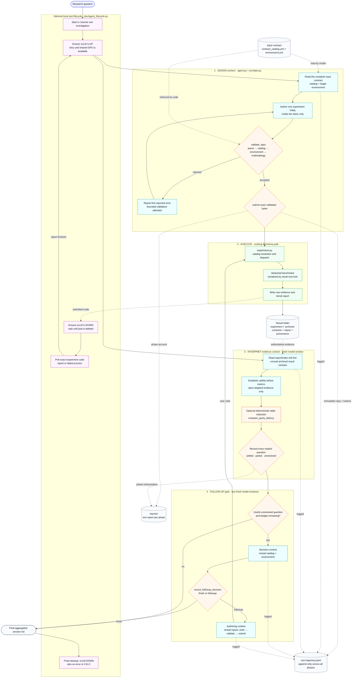

# Contract-driven benchmark agent

This is the complete description of the prototype pipeline: its two contracts,
phase and context boundaries, tools, deterministic enforcement, optional local
lifecycle wrapper, replay rules, evidence, and known limits. For commands only,
see [README.md](README.md).

The prototype demonstrates a bounded autonomous experimenter, not a general
agent framework. Its implemented catalog slice is TPC-H with PostgreSQL and
PgDuckDB. Bexhoma executes experiments through its normal entry point; agent
policy remains in `agent/`.

## Annotated end-to-end flow



The purple lifecycle lane is local operator automation. It is not visible to
the model, imported by the agent, or required by the paper prototype. Without
it, an operator or scheduler invokes the same durable phases separately.

## The two-sided contract

The input side defines what may be run. The output side defines what may be
concluded.

| Side | Authoritative artifacts | Guarantee |
|---|---|---|
| Design | `contracts/contract_catalog.yml`, `dev/catalog/environment.yml` | Legal schema, supported workloads/systems/knobs, experimental guidance, node and storage availability, resource ceilings |
| Result | Archived `contract_result.yml`, `report/index.md`, linked evidence and raw provenance | Result layout, validity checks, metric meanings, identifiers, versions, and interpretation rules |

Prompts contain role, phase, tools, budgets, and stopping conditions. Domain and
deployment facts remain in files the model must read, which makes contract
consultation measurable in the trajectory.

## Runtime sequence and modules

| Step | Code used | Responsibility and durable output |
|---|---|---|
| CLI setup | `agent/harness/agent.py::main` | Creates one investigation at design; later phases reopen it and append to its trajectory |
| Model exchange | `model_client.py::ChatModel` | Calls an OpenAI-compatible endpoint; parses tool calls; logs but does not replay reasoning |
| Design instructions | `prompts.py::design_messages` | Requires contract reads, one attributable design, validation, and submission |
| Tool boundary | `tools.py::Workspace` | Canonical read/write scopes; complete-file writes; structured tool errors |
| Agent validation | `validation.py::validate_spec` | Shape, catalog, environment, and methodology checks; expanded run count |
| Shared resolution | `bexhoma/spec.py` | Existing profile, override, quantity, environment, and command resolution |
| Submission | `tools.py::submit`, `submit.py` | Fingerprint check, immutable copy, code allocation, result-root lock, agent-side catalog launch adapter, provenance archive |
| Execution | Normal Bexhoma workload modules | Workload execution, raw files, validity results, tiered report; no Bexhoma code modification required |
| State recovery | `agent.py::_carry_forward` | Rebuilds question, exact specification, code, budget, and previous-result handoff from trajectory data |
| Evidence interpretation | `prompts.py::interpret_messages`, `agent.py::run_interpret` | Fresh read-only context; validity-first analysis; structured question coverage |
| Deterministic comparison | `tools.py::compare_query_latency` | Matched-run TPC-H per-query reduction without model arithmetic |
| Follow-up decision | `prompts.py::followup_decision_messages` | Fresh read-only context; complete design-space reread; finish/follow-up record |
| Follow-up authoring | `prompts.py::followup_author_messages` | Fresh mutation context; same write/validate/submit boundary as design |
| Local automation | `dev/agent_lifecycle.py`, `dev/model_server.sh` | Optional vLLM switching, result polling, retry, resume, and cleanup |

One reusable loop, `agent.py::_converse`, drives every model context with a
different prompt, tool list, stopping predicate, and budget. A text answer is
rejected when the phase still requires a structured record.

## Capability boundary

The model never receives a shell, Kubernetes client, network client, or general
filesystem access. Tools are exposed by context:

| Context | Tools |
|---|---|
| Design | `read_file`, `write_file`, `validate`, `submit` |
| Evidence interpretation | `read_file`, `compare_query_latency`, `list_results`, `record_interpretation` |
| Follow-up decision | `read_file`, `record_followup_decision` |
| Follow-up authoring | `read_file`, `write_file`, `validate`, `submit` |

Writes resolve to one YAML file directly inside the inbox. Reads resolve only
inside contracts, the inbox, the configured result root, or explicitly allowed
environment files. Canonicalization happens before authorization, blocking
`..` and symlink escapes.

Successful validation stores a fingerprint of the specification, catalog, and
environment. Submission recomputes it and refuses changed bytes. The result
folder archives those exact inputs, while the trajectory records their hashes.

## Phase state and follow-ups

Each process performs one durable phase and exits, but all processes belonging
to the same question share one investigation directory and trajectory:

1. Design ends after submission and records the experiment code.
2. Execution is detached and owns the result-root lock.
3. Interpretation reopens the investigation only after its exact report exists
   and appends its events to the same `trajectory.jsonl`.
4. With budget, evidence, follow-up selection, and follow-up authoring use
   separate context windows and separate file-read allowances.
5. A submitted follow-up ends that invocation. Its result is interpreted by a
   later process with a bounded handoff reconstructed from the same trajectory.

The follow-up count is persisted in outcomes. A successful submission consumes
one unit. The loop ends when interpretation is complete without a new code.

## User-facing answer contract

Every phase response is preserved under `reports/`. The top-level `answer.md`
is not an intermediate status file: it is written only when an interpretation
finishes without submitting another experiment. That final interpretation is
required to aggregate the complete study, and the harness copies it verbatim;
it does not silently rewrite or correct model output. Interpretation prompts
require the report to be self-contained and use this order:

1. original question;
2. hypothesis;
3. experiments performed;
4. validity;
5. results;
6. interpretation;
7. follow-up rationale and intervention, when present;
8. final verdict and remaining limitations.

The final context receives the current specification, the preceding
specification and report, the previous interpretation, and the structured
follow-up decision. This gives the model the complete study chain needed to
write those sections. The investigation also contains `task.txt`, immutable
per-phase submission/log artifacts under `phases/`, all phase accounts under
`reports/`, and one append-only `trajectory.jsonl` for the whole chain.

## Local lifecycle wrapper

`dev/agent_lifecycle.py` implements the phase re-entry loop for this cluster's
testing only. It calls the public agent CLI and reads only trajectories, status
files, and reports. Neither the agent nor Bexhoma imports it.

For a new question it performs:

```text
vLLM up → design → vLLM down → wait for report
        → vLLM up → interpret
        → [follow-up code: vLLM down → wait → vLLM up → interpret]*
        → final answer → vLLM down
```

The low-level switch refreshes the local OIDC login noninteractively, applies
the pinned vLLM manifest, waits for readiness and the local API, and waits for
pod deletion on shutdown. The wrapper retries startup indefinitely by default
because releasing a shared GPU creates a race: another workload can take it
before interpretation begins. Set a finite `--server-start-attempts` to fail
instead. `--resume` continues a submitted investigation without submitting it
again. The `finally` block requests shutdown after success, failure, or
interruption; the weights PVC is retained.

Autonomous switching does not mean guaranteed immediate capacity. If every H200
is allocated, the vLLM pod remains Pending and interpretation waits until a GPU
returns. Kubernetes priority or a reserved GPU would be required for a bounded
restart time.

## Placement and replay

The definitive submitted specifications contain:

```yaml
placement:
  sut: cl-worker36
  loading: cl-worker36
  benchmarking: cl-worker36
```

These are literal Kubernetes node names selected from the original
`environment.yml`. A different cluster usually has no node named
`cl-worker36`, so its validator correctly rejects the unchanged file. This is
the local placement referred to in the reproducibility assessment.

There are three useful replay levels:

1. **Audit the original run.** Keep the submitted file unchanged beside its
   archived environment and result evidence. It records exactly what ran.
2. **Repeat the same experimental design elsewhere.** Copy the specification,
   replace each placement value with a node from the target's freshly generated
   environment, or omit `placement` so the target scheduler chooses. Revalidate
   before submission. This changes deployment binding, not the workload,
   treatment, resources, rounds, or repetitions.
3. **Let the agent adapt the design.** Generate the target environment and ask
   the original question again. The agent chooses legal placement from that
   descriptor and produces a new auditable specification.

This working tree also carries local `nodeSelector` edits in several Kubernetes
templates. They intentionally force this test cluster onto `cl-worker36` and
must not be included in a portable release. Removing placement from YAML is not
enough while those local template overrides remain. A portable repository must
leave templates unpinned and let the experiment's placement flags, or the
target scheduler, supply the binding.

An unchanged byte-for-byte specification can run elsewhere only if the target
also exposes the same node names and compatible resources. For a future
portable replay format, abstract roles such as `sut-node` would need a separate
per-cluster role-to-node binding; the current schema uses literal names.

## Evidence from the definitive run

The unedited successful chain predates the single-investigation layout and is:

| Role | Trajectory | Outcome |
|---|---|---|
| Initial design | `20260819T233939862899` | Submitted `1787175665`; one follow-up remained |
| First interpretation and follow-up | `20260820T003559431500` | Recorded comparison unresolved; submitted `1787179264` |
| Final interpretation | `20260820T015516527941` | Recorded every explicit question settled; final answer |

Both reports passed all seven validity checks. For each experiment, the
submitted YAML and archived `experiment.yml` had identical SHA-256 hashes. One
premature prose completion was rejected until the model called
`record_interpretation`, directly demonstrating enforcement rather than prompt
compliance alone.

The historical final `answer.md` predates both the self-contained answer
contract and the single-investigation layout. Its surrounding study record is
split across the three trajectory directories,
their two submitted YAML files, the first interpretation/follow-up answer, and
the two external result reports. Historical model output remains unchanged.

This supports the paper claim that, given machine-readable input and result
contracts, a tool-bounded agent can design, validate, submit, interpret, and
follow up on a supported benchmark while preserving an auditable record across
process boundaries.

## Known limits

- The catalog implements a narrow prototype surface, not every Bexhoma workload
  and system.
- Duration estimation is not calibrated.
- Environment validation checks declared capacity and may lack current free
  capacity.
- The filesystem lock serializes harness launches on one host/result root, not
  direct Bexhoma commands or cluster-wide submissions.
- Cross-experiment validity remains an interpretation responsibility.
- Exact cross-cluster numbers require pinned images and package versions plus
  captured hardware, storage, and runtime conditions.
- Temperature zero does not guarantee identical model decisions; exact model
  weights, tokenizer, and serving configuration are not archived by the
  trajectory.
- The optional local lifecycle can wait for shared GPU capacity but cannot
  create or reserve it.

## Documentation ownership

- This file is the single full pipeline and decision description.
- [README.md](README.md) is the single quick-start guide.
- `contracts/contract_catalog.yml` and `contracts/contract_result.yml` are the
  normative machine-readable interfaces.
- `docs/Design-Catalog-Contract.md` and `docs/AgentResultContract.md` explain
  the broader reusable Bexhoma contracts.
- `docs/FEATURES.md` is historical traceability, not another user guide.
