# How the BeXhoma agent works

**Implementation review and diagram atlas · 21 September 2026**  
**Snapshot:** `66a67a58d0cd01e4ba01cfbe735b72aa1462e955` · BeXhoma v0.10.13  
Prepared for the repository owner from the checked-out implementation, contracts, deployment manifests, maintained tests, and offline audit probes.

The current agent is a bounded experimenter: a language model proposes a benchmark, Python validates and submits it, BeXhoma executes it, and the model interprets the resulting evidence. A further experiment can follow if the interpretation requests one and the investigation still has a follow-up budget. The model does not update its weights during this process. Its durable memory consists of files and event records.

The strongest property is the separation of scientific judgment from execution: the model proposes designs and conclusions, while ordinary code checks specifications, resource constraints, evidence references, and selected numerical claims. The most important limitation is that several intended boundaries are incompletely enforced. In particular, the runtime does not reject a tool merely because that tool was absent from the current phase's advertised list. The audit reproduces an unadvertised write during interpretation and a mocked submission during a dry run.

There is **no evidence of project-specific Qwen fine-tuning in the reviewed repository**. There is substantial Qwen-specific serving configuration and some Qwen-motivated inference handling. Other changes explicitly arose during Mistral runs. Whether the overall agent is empirically over-adapted to any model remains unmeasured by this review.

The explanation below describes current behavior. The diagram atlas follows the explanation, then the weakness assessment and Qwen analysis. Source references identify the exact reviewed commit. “Confirmed” means established by code or an offline probe; “risk” means an inferred failure mode whose incidence has not been measured.

## 1 Scope and terms

An **investigation** is one user question plus its sequence of designs, submitted experiments, interpretations, and follow-ups. An **experiment** is one accepted specification with a numeric experiment code and its own result directory. A **phase** is one harness invocation, such as design or interpretation. An interpretation invocation can contain two separate model conversations: evidence interpretation and follow-up authoring.

A **contract** is a machine-readable document that defines permitted experiments or the meaning of results. The **catalog** describes supported workloads, database systems, parameters, profiles, and the experiment schema. The **environment descriptor** is a saved description of available cluster resources. The **handbook** is methodological guidance about designing and interpreting experiments. A **tool** is a named Python operation requested through the model API. A **gate** is a deterministic condition that must pass before an action or structured record is accepted.

The implemented catalog covers TPC-H, an analytical SQL workload, on PostgreSQL and PgDuckDB, and YCSB, a key-value workload, on PostgreSQL. The broader BeXhoma project supports more systems and workloads, but that does not make them automatically available to this agent. Catalog support also requires a corresponding resolver and execution path. [S3, S8]

This review does not claim to have exercised a live model, authenticated to a cluster, or measured benchmark quality. It does not inspect private model weights or prove what a running server currently has loaded. The untracked design notes preserved during the preceding merge are not treated as authoritative implementation evidence.

## 2 The components and their responsibilities

| Component | What it does | What it produces |
|---|---|---|
| Command-line entry point | Selects design, interpretation, or bare-model baseline; resolves paths and settings; opens the investigation | Phase directory, task file, trajectory, phase reports |
| Prompt builders | Explain the phase, tools, reading requirements, budgets, and stopping conditions | Fresh system and user messages |
| Model adapter | Sends chat-completion requests to the configured endpoint and parses text and tool calls | Visible answer, optional reasoning field, calls, token usage, finish reason |
| Conversation loop | Processes model replies, runs tools sequentially, returns tool results, counts turns and validation attempts | A record of every exchange and a phase outcome |
| Workspace | Controls file paths, bounded reads, draft writes, validation approvals, submission, and result discovery | Draft specifications, submitted snapshots, status records |
| Validator | Checks schema, supported options, method rules, and environment fit using the shared BeXhoma resolver | Structured verdict and run/time estimates |
| Submission adapter | Refreshes credentials if configured and invokes the existing workload entry module | Detached BeXhoma execution under an assigned experiment code |
| Interpretation gate and assessor | Check evidence reads, validity counts, selected numerical claims, and the structured decision | Accepted interpretation record and portable experiment summary |
| Optional local lifecycle | Starts and stops the bundled model server and chains durable phases | Automatic wait, resume, and cleanup behavior |
| Optional cluster controller | Builds runtime configuration from a service account and durable storage; recovers submitted work | Restartable lifecycle Job |

There is one model-calling process at a time along the ordinary phase path. These components are not independent collaborating agents, and there is no implemented planner/critic committee, retrieval database, or training loop. Tool calls returned together are processed in sequence. [S1–S7]

## 3 Inputs and configuration

The user supplies a research question. The harness supplies the model with pointers to the catalog, environment, and handbook rather than pasting all domain facts into the initial prompt. Reading those files becomes observable in the trajectory. Initial authoring requires the catalog, the available environment, and the handbook's Navigation section if a handbook is enabled. This checks that content was returned; it does not prove comprehension. [S1]

An experiment specifies a title, hypothesis, the factors it intends to distinguish (`discriminates`), workload and parameters, repetitions and concurrency rounds, systems and profiles, and resource/storage choices. It can also express placement, observation settings, a loading timeout, and parent lineage. The supported comparison factors are system, concurrency, CPU, and memory. A system's profile and allowed options constrain its configuration. [S3, S8]

Configuration follows command-line overrides, then exported environment variables, then values loaded from `.env`. The example defaults select `qwen3.8-27b` at a port-forwarded local endpoint. The low-level harness defaults its endpoint to port 8000; the local lifecycle defaults to port 8001. Neither default proves which endpoint an operator actually uses. The result root normally comes from `cluster.config`; explicit arguments and `AGENT_RESULTS` can override it. [S1, S5, S9]

The model's available tools depend on the advertised context:

| Context | Advertised tools | Intended work |
|---|---|---|
| Initial design | `read_file`, `write_file`, `validate`, `submit` | Author and submit one experiment |
| Evidence interpretation | `read_file`, `assess_comparison_quality`, `record_interpretation` | Examine one result and record a verdict |
| Follow-up authoring | `read_file`, `write_file`, `validate`, `submit` | Implement the selected follow-up |
| Baseline | None | Answer from the model alone |
| Dry-run authoring | Authoring tools with `submit` removed | Produce a validated proposal |

**Current implementation caveat:** this is an advertised interface, not a complete runtime authorization table. Dispatch falls through to the workspace for other known tool names. Sections 16 and 19 document the consequence. [S1, S2]

## 4 Initial design and the model loop

The command-line entry point creates a timestamped investigation and a numbered phase directory. It records the original task, the served model identifier, temperature, output-token ceiling, contract and environment hashes, handbook hash, follow-up budget, and harness identity. Harness identity includes the checkout commit where available and a hash of the harness Python source files. It does not hash the complete execution environment. [S1]

The model receives a fresh design conversation. It normally reads the design documents, writes a complete YAML file directly into the inbox, asks the validator to check it, and repairs rejected drafts. Every error and prior reply remains in that design conversation. The model can choose another design after feedback, but the validation budget limits how often it may ask for another check.

The default is **three validation calls**, and the design turn ceiling is `6 × attempts + 2`, therefore 20 turns with the defaults. The last two are budgeted slack for closure; the implementation uses one total turn limit, not a guaranteed separately reserved closing phase. Some older inventory text says six validation calls, but the current constants and parser use three. [S1, S5, S11]

On every turn, the loop logs the returned text, server-provided reasoning, requested calls, reported usage, finish reason, and effective output-token budget. It appends the assistant message to the conversation, dispatches calls sequentially, logs results, and returns results under the corresponding call identifiers. Invalid JSON arguments produce a tool error rather than executing that call. Tool failures covered by the workspace's exception handling are returned as error objects so the model can repair them.

If the model returns only reasoning and no text or tool call, the loop can nudge it to act, up to three consecutive nudges. This is bounded retry behavior, not learning. A successful submission ends the useful work of the design phase; tools are then withdrawn for a closing explanation. A design can count as complete after submission even if the model gives no closing prose, in which case a fallback account is written. [S1]

After the final allowed validation succeeds, the loop tries to keep handover possible so the valid draft can still be submitted. When checks fail and the allowance is gone, it asks for an explanation of what remains unresolved. Initial design does not require a structured finish record as interpretation does; a premature textual response may simply lead to an incomplete phase.

## 5 What validation actually establishes

Validation does not contact Kubernetes or run a benchmark. It loads the draft and catalog, checks structure and supported fields, and calls BeXhoma's catalog resolver to build the workload arguments. Independent structural or method failures can be reported together. Prompt wording about returning only the first error is therefore an incomplete description of current behavior. [S3]

The principal checks are:

| Layer | Current checks | What a pass does not establish |
|---|---|---|
| Parse and shape | Readable YAML, expected object structure, required/allowed fields and types | That the scientific question is sensible |
| Catalog resolution | Supported workloads, systems, profiles, options, quantity values, and executable argument resolution | That the workload is representative of production |
| Factor declaration | Declared factors match the factors represented as varied by the specification | Causal identifiability against every real-world nuisance factor |
| Falsifiability heuristic | Rejects some adequacy-only hypotheses using textual markers | A formal, measurable hypothesis or pre-registered decision rule |
| Fixed resource envelope | Rejects explicit unequal request/limit pairs in comparison resources | Physical CPU isolation or freedom from noisy neighbors |
| Resource attribution | CPU and memory must each vary alone somewhere if both are declared | Complete factorial coverage, randomization, or sufficient statistical power |
| Repetition floor | Catalog minimum, otherwise a floor of two for comparisons; TPC-H declares three | Confidence intervals or a power calculation |
| Environment | Resource ceilings, placement and storage compatibility; peak benchmarker-plus-SUT limits for pinned placement | A live reservation of that capacity or a fresh cluster snapshot |

CPU and memory lists are **paired by position**, not multiplied together. A single resource cell is broadcast across the other list. Systems and concurrency rounds are crossed with these resource cells. The run-count estimate is systems × resource cells × rounds × repetitions. For example, two systems, two resource cells, three concurrency levels, and three repetitions imply 36 benchmark phases. This is an illustrative expansion, not a measured run. [S3]

The validator also calculates a conservative deadline budget when the needed fields are available. Query count, per-query repeats, query timeout, and expanded phase count contribute to the benchmark budget; declared loading deadlines contribute separately. `duration_min` itself remains unset. This is not a runtime forecast or an enforced investigation-wide time/cost cap.

When the environment file is absent, validation may return `valid: true` with `environment_checked: false`. Such a result does not authorize submission. Submission approval is stored only after both catalog/method checks and environment checks pass. The approval binds hashes of the draft, catalog, and environment. Editing any of those invalidates the comparison at submission. [S2, S3]

## 6 Submission and benchmark execution

Submission checks the approved fingerprint and requires a known result root. It claims a result-root lock that normally prevents overlap with another agent-started benchmark. The low-level CLI can explicitly allow overlap; such a submission records that choice. The lock protects against cooperating local processes, not every job or user on the cluster. [S2, S12]

The harness allocates an experiment code from wall-clock seconds, reserving it through exclusive creation of a status file and incrementing on collision. It copies the specification to the phase directory, stages the catalog, environment, and result contract, and starts a detached Python child with a log file. The lock record is transferred to the child's process identifier. The child outlives the model-facing process.

The actual child is `agent.harness.submit`. It can execute an operator-configured credential-renewal command with a 120-second timeout; that command is not a model-exposed shell tool. It resolves the catalog specification, appends the assigned experiment code and report flag, and dispatches through the workload's existing entry module. TPC-H gets per-system physical-design overrides in-process; YCSB enables catalog-driven SUT resource application. BeXhoma then handles the database deployment, loading, benchmark jobs, monitoring, cleanup, evaluation, and report generation. [S4]

The submission tool waits up to 120 seconds for the exact result directory. If the directory appears, staged provenance is copied into it and state becomes `running`. If the child exits first, state becomes `failed`. If the child remains alive without the directory, submission returns the durable code with state `starting`; it does not kill a slow launch. Later discovery can archive the staged inputs once the directory appears. A report's presence is used to derive `finished`. [S2]

**Provenance caveat:** the first launch passes the live catalog path to the child even though a staged catalog exists. The fingerprint check and archive are useful, but they do not eliminate a catalog-change race between approval and the child's read. Controller restart uses the staged catalog. [S2, S4, S6]

## 7 Evidence interpretation and claim checking

Interpretation starts in a fresh model conversation after the exact report exists. It receives the original question, the experiment specification that ran, and the report path. It does not replay the design's repair conversation. The command-line path prefers the archived experiment and result contract from that result directory; if no archived result contract exists, it falls back to the repository contract. An explicitly selected report can be interpreted without a prior local investigation. [S1]

The workspace initially authorizes the selected report, result contract, archived experiment, and configured handbook. Reading a Markdown file can authorize existing local files linked from that page, provided they resolve inside the same result directory. Another result's raw evidence remains outside this interpretation read set. Path resolution precedes authorization, so ordinary traversal and symlink escapes are checked against canonical paths. Link discovery scans the entire source Markdown page, even when the returned text was only a selected section. [S2]

The model must consult the report and its Tests section, the result contract, and the interpretation handbook chapters that still exist under their expected headings. Current named chapters are Navigation, Factors and controls, The load model, Repetition and noise, and Metrics. The gate requires explicit section reads for these handbook chapters. Removing or renaming one of the expected headings makes that chapter disappear from the enforced requirement. [S1, S10]

If a benchmarking evidence page exists, the model must invoke the deterministic comparison assessor. It parses the report's Markdown tables and the archived specification to compute:

- Query coverage and failed-query sets where the report exposes them, and whether whole-workload throughput compares the same completed work.
- Suspicious repetitions: an aggregate latency at least three times away from peer-median latency is flagged for disclosure, not automatically discarded.
- Ordered CPU, memory, and concurrency trends while holding other declared factors fixed, plus categorical system rankings for supported throughput and latency metrics.
- Failure scope, including special handling for recognizable CPU-monitoring-only failures so they do not automatically invalidate performance measurements.

Trend classification uses per-level means and a heuristic noise half-width: the greater of half the observed range and five percent of the mean's magnitude. Adjacent means are treated as indistinguishable when their difference is within the sum of these half-widths. The resulting labels include rising, falling, saturation, reversal, flat, and non-monotone. These are descriptive heuristics, not formal significance tests. Query errors suppress aggregate factor claims that would compare unequal completed work. [S2]

The model submits a structured interpretation containing a scientific hypothesis verdict, technical validity, comparison quality, typed result claims, per-question conclusions, and a finish/follow-up decision. Hypothesis status is supported, refuted, inconclusive, or invalid. Question status is settled, partial, or unresolved. The gate checks exact failed-check counts, computed affected phases, selected assessor fields, and exact typed claims. Cited paths must have been read; hypothesis evidence must be inside the selected result directory. A settled question must declare supported evidence and no missing evidence. [S1]

These checks substantially constrain selected factual fields. They do **not** establish that every natural-language conclusion follows from its citation, that every part of the user's question was enumerated, or that the final prose agrees with the accepted structured record. A read path is evidence of access, not semantic support. The audit demonstrates this distinction.

After acceptance, the model gives a tool-free closing account under the result contract's answer instructions. The contract asks for the recorded hypothesis, scientific verdict separate from mechanical validity counts, cited evidence, and a proposed follow-up if needed. The harness writes a compact `agent_summary.yml` beside the result. That summary records code, parent, hypothesis, verdict, evidence paths, validity scope, and unresolved question. [S1, S8]

## 8 Follow-ups and memory across experiments

A recorded follow-up needs an unresolved question, experiment goal, rationale, and cost rationale. A targeted query list and a declaration that the full workload is needed are mutually exclusive. A finish decision must leave follow-up-specific fields empty. A follow-up decision with zero remaining budget documents further work but does not schedule it. [S1]

With budget remaining, the harness creates another fresh model conversation for authoring. It supplies the original task, the completed interpretation, the structured decision, parent specification, and compact earlier ancestor summaries. It restores design reads and resets the file-reading allowance. The model must reread its design inputs before using the ordinary write path.

Follow-up validation adds three important conditions: `follow_up_of` must exactly equal the current experiment code; execution settings must differ from the parent's after descriptive fields are excluded; and an approved target-query subset must match the draft. The ordinary validator then runs. Successful submission spends one follow-up unit. An execution-identical repeat is refused, so simply asking to rerun the same treatment for confirmation is not represented as an accepted follow-up under this rule. [S1]

Ancestor summaries are traversed through numeric parent codes, oldest first, stopping at missing, malformed, mismatched, or cyclic records. They guide authoring rather than serving as raw evidence for the current interpretation. There is no general synthesis of all experiments' measurements. The top-level answer normally explains the most recently interpreted result. That limits cumulative research claims even when the investigation contains several experiments.

Context separation is genuine at the prompt level, but not complete at the filesystem boundary: ordinary design reads include the configured result root. Therefore the intended restriction against browsing old results during design or follow-up is weaker than the documentation suggests. [S2]

## 9 Durable records and outputs

The persistence model is file-based; the entity relationship diagram later is a logical model, not an implemented relational database schema.

```text
result-root/
  agent/
    inbox/                            shared drafts under the local defaults
    status/<experiment-code>.json     state, PID, paths, staged provenance
    <investigation>/
      task.txt
      trajectory.jsonl               append-only event records
      phases/01-design/
        submitted-experiment.yml
        submitted-contract_catalog.yml
        submitted-contract_result.yml
        submitted-environment.yml
        bexhoma.log
      phases/02-interpret/...
      reports/01-design.md
      reports/01-design-reasoning.md
      reports/02-interpret.md
      reports/02-interpret-reasoning.md
      answer.md                      final completed output
  <experiment-code>/
    experiment.yml
    contract_catalog.yml
    contract_result.yml
    environment.yml
    agent_summary.yml                after accepted interpretation
    report/index.md
    report/{workflow,loading,benchmarking,monitoring,connections}.md
    ... raw benchmark and execution evidence
```

Paths are configurable, and the in-cluster controller uses a different durable directory arrangement with per-lifecycle inbox and status directories. A completed design may gain scale-factor and served-model suffixes in its investigation name. Failed/incomplete designs can retain timestamp-only names. [S1, S2, S6]

Trajectory events include metadata, task, assistant replies, tool calls/results, stage resets, exhausted budgets, stalled turns, rejected completions, outcomes, artifacts, and abort/error records. These support audit and state reconstruction. File-read tool logging omits full returned file text, so the trajectory alone is not a complete immutable copy of every observed byte. Separate contract snapshots and result files matter. [S1]

Each phase produces an account and a rendered reasoning trace when its normal reporting path is reached. `answer.md` is written for a complete phase without a submitted code. This includes a finished interpretation, a baseline, and a successful design dry run; the name alone does not prove that benchmarks ran. Submitted follow-ups produce phase reports, with the final answer deferred to a later interpretation. [S1]

## 10 Model serving and bounded context

The adapter uses a configurable chat-completions endpoint. It can discover a dedicated endpoint's sole served model when the configured name does not match; a multi-model endpoint requires an exact match. This improves portability but can silently adopt an unintended single model unless operators check recorded metadata. [S7]

The default generated-token ceiling is 16,384, including reasoning. If the endpoint advertises its context length, the adapter estimates remaining room, holds back 512 tokens for formatting, and refuses a turn with less than 1,024 tokens of generation space. It anchors estimates on previously reported prompt-token counts, estimating newly appended messages at three characters per token. A context-length rejection that exposes its limit can trigger one resized retry. There is no automatic conversation compaction. [S7]

File reads also have their own limits: 24,000 characters for an ordinary read, 12,000 for a selected Markdown section, 48,000 for authoritative files, and 110,000 returned characters per context. Large Markdown requires a heading; section offsets allow continuation. Authoritative files are intended to be returned complete or refused, subject to the specialized section handling. These character limits are not the same as token limits. [S2]

The adapter retries rate limiting and internal server errors up to six outer attempts, with exponential waits starting at five seconds and normally capped at 60 seconds; a server-provided retry delay can supersede that schedule. The underlying SDK may also retry. Connection failure and exhausted context are surfaced as failed/aborted phases. The API client timeout is 600 seconds. [S7]

The current adapter removes both `reasoning` and `reasoning_content` from replayed assistant messages while logging them separately. It sends temperature, model, messages, maximum output, and optionally tool schemas. It exposes no current configuration for preserved thinking, reasoning effort, top-p, or top-k. Its retained prompt-token counters are not explicitly reset when the evidence conversation is replaced with follow-up authoring; the audit reproduces a stale-count case. [S7]

## 11 Local and in-cluster lifecycle

The optional lifecycle starts the bundled model server, optionally runs a bare-model baseline, invokes design, shuts the model server down after submission, waits for that experiment's report, restarts the server, and invokes interpretation. It repeats this sequence for submitted follow-ups. A `finally` cleanup attempts server shutdown on ordinary completion, error, or interruption. An externally owned endpoint skips server switching while retaining phase chaining. [S5]

The baseline is a separate investigation with no catalog, environment, handbook, or tools. It usually takes one call, with up to four total turns to recover reasoning-only replies. Its failure does not block the benchmark investigation. A link in the design trajectory ties the baseline answer to the investigation; there is no automatic scoring of their relative quality. [S1, S5]

The lifecycle polls every 30 seconds by default. A benchmark timeout of zero waits indefinitely; zero server-start attempts means indefinite retries. Definitive failed status or a dead benchmark process triggers cleanup of that exact experiment. A wait timeout raises an error without necessarily stopping the benchmark. The bundled server has an independent watchdog: it polls activity every 60 seconds, regards running/waiting requests and changing cumulative counters as activity, and stops after 1,200 idle seconds. Model weights remain on persistent storage for reuse. [S5, S9]

The cluster controller runs as a Kubernetes Job with a service account, namespace permissions to manage workload objects, and separate read permissions for cluster facts. It uses persistent storage for state and results, writes an in-cluster kubeconfig, adapts runtime cluster configuration, and refreshes the environment. On restart it can recover a recorded submission from status data and relaunch BeXhoma orchestration using the archived specification/catalog and same experiment code. It then resumes the local lifecycle logic. This is targeted recovery for submitted work, not a durable checkpoint of every model turn. [S6]

The shipped controller manifest is a template: its image and namespace binding contain placeholders. It has a Job retry limit of six and no global active deadline. The model server has one GPU, 48 GiB requested/96 GiB limited host memory, a 150 GiB weights volume, a served 131,072-token context, and Qwen-specific parsers. It accepts H100/H200 placement and excludes the configured benchmark node. Multiple controllers in one namespace still use common model-server object names, creating a coordination risk. [S9]

## 12 Concrete example from question to answer

Suppose the question is whether PgDuckDB outperforms PostgreSQL for a selected analytical query as concurrency rises. This is an illustrative walkthrough; no new benchmark was launched for this report.

The model reads the supported catalog and current environment, chooses equal fixed CPU/memory allocations, selects both systems, names system and concurrency as the varied factors, and chooses three repetitions. The specification goes through structural, catalog, method, and environment checks. If the proposed benchmarker placement exceeds a pinned node's declared capacity, the model gets a structured error and revises within its attempt budget.

After successful validation, submission reserves a code and starts BeXhoma. The local model server can be off while the databases load and benchmarking runs. When the report is ready, a fresh interpretation reads validity first. If one system's selected query failed, its apparent throughput is not treated as a fair same-work comparison. If timings differ sharply between repetitions, the anomaly is disclosed.

The model records whether the hypothesis is supported and whether the original question is fully settled. If it requests a focused follow-up and still has budget, another fresh context authors it with the previous code as parent. That experiment is executed and interpreted separately. Otherwise, the final account is written. This process supports attributable local comparisons; it does not by itself justify broad claims about every analytical workload or all production deployments.

## 13 Diagram atlas

The graphs below are rendered, offline SVGs. Every diagram also has editable Graphviz DOT source in the `diagrams` directory. In the HTML report, use **Enlarge** and zoom controls for detailed diagrams. Arrows show control or data flow as labeled; dashed red arrows indicate current implementation gaps or risks, not desired behavior. The logical event graph is not a message-broker architecture.

### 13.1 System context and responsibility graph

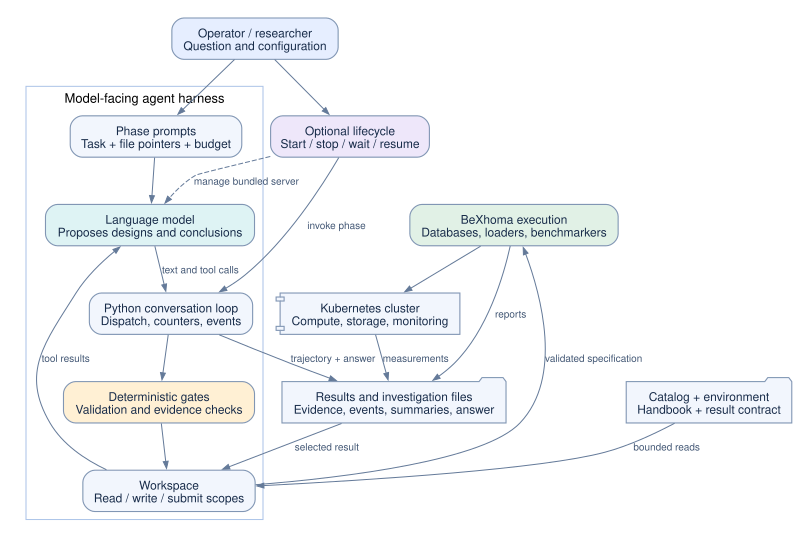

This view separates the model from the Python control layer, the execution backend, and the operator-owned lifecycle. [S1–S9]

### 13.2 End to end event graph

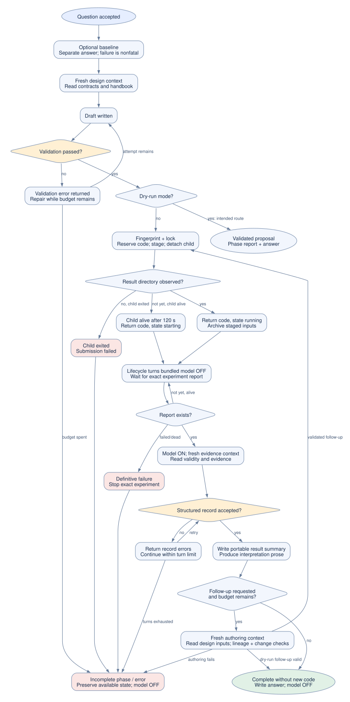

Logical triggers and durable outcomes cover design, rejection, submission, slow startup, execution failure, interpretation, follow-up, and final output. Baseline and dry-run exits are included. [S1, S2, S5]

### 13.3 Tool calling sequence

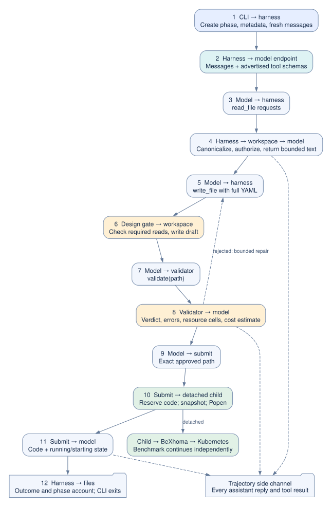

Numbered exchanges show one normal design iteration and handover. Repeated tool calls return into the same phase conversation; benchmark execution continues independently afterward. [S1, S2, S7]

### 13.4 Investigation and experiment state graph

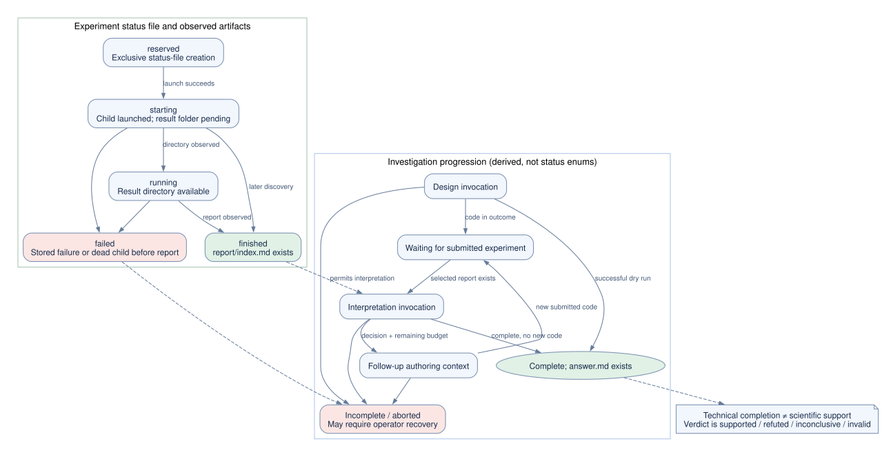

Experiment status-file states and investigation completion are distinct. “Finished report” is an execution artifact condition, not a supported scientific hypothesis. [S1, S2, S5]

### 13.5 Entity relationship graph

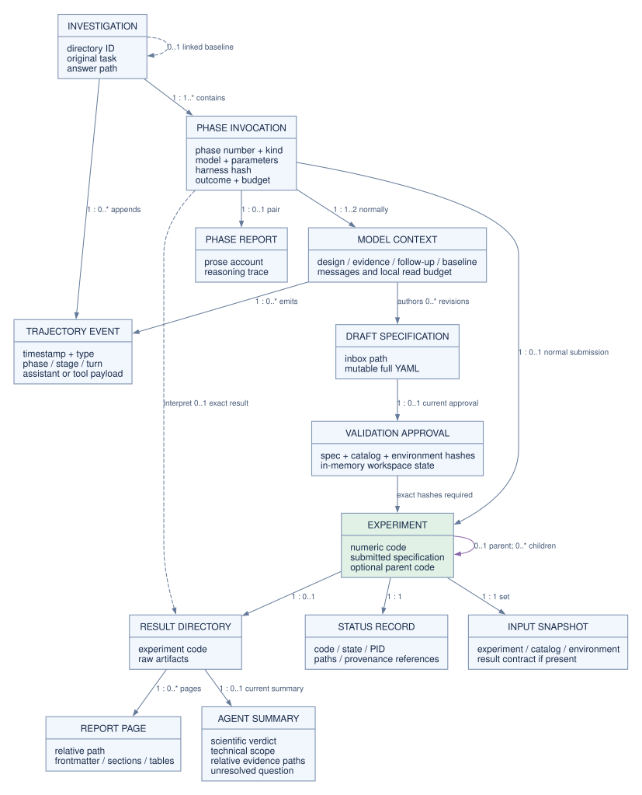

Numbers on edges give logical cardinalities. An investigation contains many phase invocations and events; each normal authoring phase submits at most one experiment, and an experiment can have a parent. Drafts and status are shared under local defaults. A baseline is a linked separate investigation. Reinterpretation can overwrite a result's one portable summary. [S1, S2, S6, S8]

### 13.6 Context and memory graph

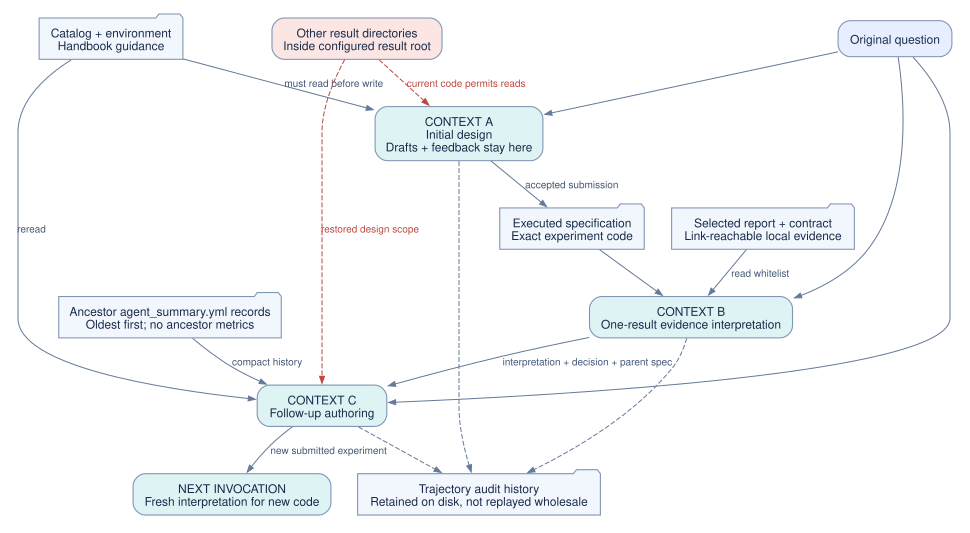

Fresh model contexts receive selected handoffs. Complete historical conversations stay in the audit log. The red edge marks the broader-than-intended design read scope. [S1, S2, S10]

### 13.7 Validation decision graph

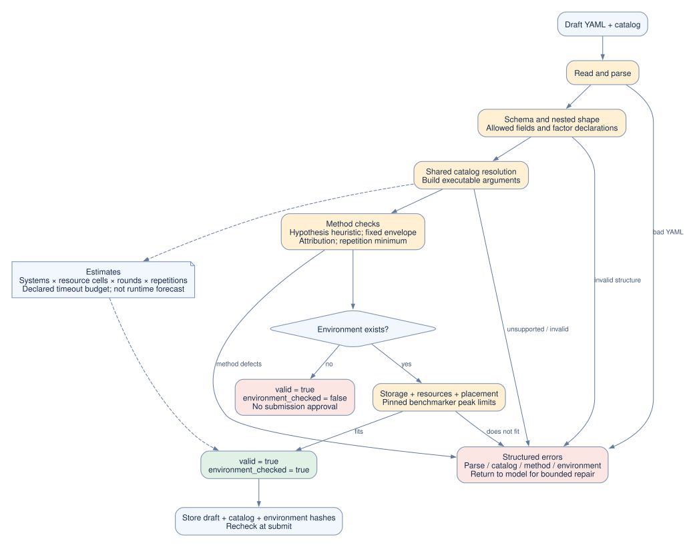

Methodology checks occur before environment checks in the implementation. Catalog-valid but environment-unchecked is a weaker result and cannot grant a submission approval. [S2, S3]

### 13.8 Interpretation and evidence graph

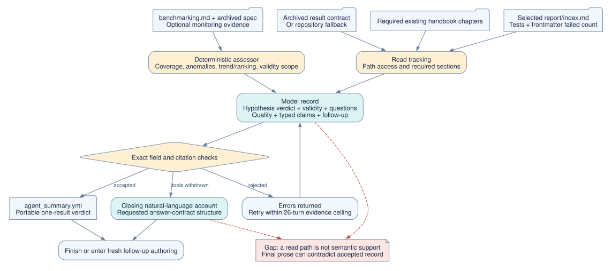

The deterministic assessor constrains structured fields, while explanatory conclusions and final prose remain model judgments. This distinction matters for assessing answer reliability. [S1, S2, S8]

### 13.9 Follow up decision graph

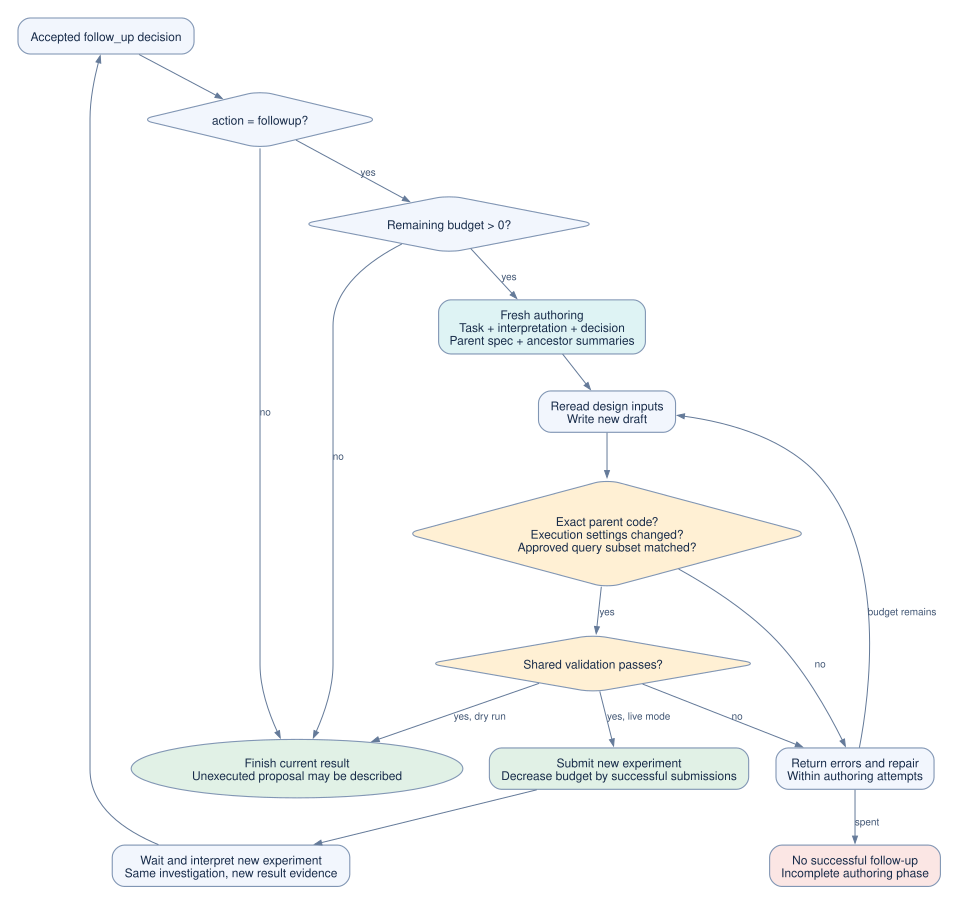

The remaining budget, controlled-change check, lineage, target-query rule, and eventual no-budget exit are explicit. A failed authoring phase does not spend a successful-submission unit. [S1]

### 13.10 Deployment and GPU lifecycle graph

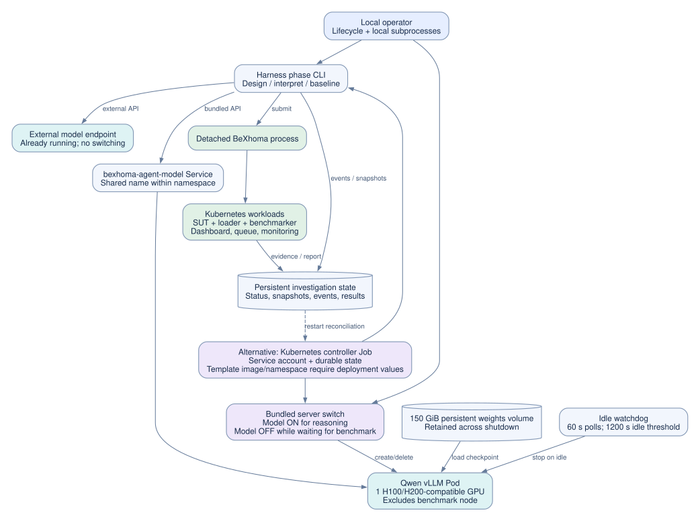

The operator can run the lifecycle locally or in a controller Job. Bundled GPU ownership follows model phases, while external inference follows its own lifetime. [S5, S6, S9]

### 13.11 Provenance and artifact lineage graph

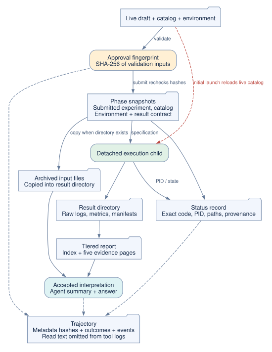

Validation fingerprints, submitted snapshots, result evidence, summaries, and reports serve different purposes. The live-catalog launch edge shows the remaining race in initial submission. [S1, S2, S4, S6]

### 13.12 Failure and recovery graph

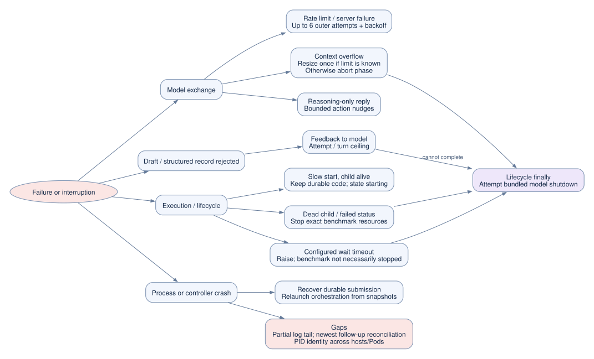

Recovery is bounded for model calls, optional/unbounded for lifecycle waits, and incomplete for malformed logs and some crash windows. [S1, S5–S7]

### 13.13 Model dependence and evaluation graph

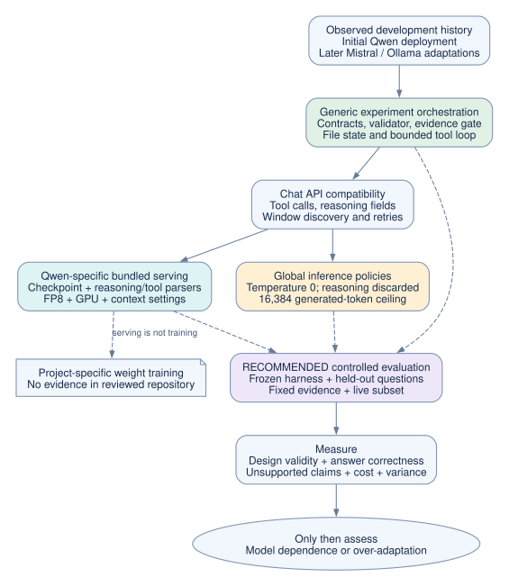

This view distinguishes generic orchestration, provider compatibility, Qwen-specific serving, and the missing controlled evidence needed to claim model neutrality or over-adaptation. The dashed evaluation branch is a recommendation, not a current subsystem. [S7, S9, S11]

## 14 Strengths worth preserving

The agent makes experiment design inspectable. The original question, rejected drafts, tool outcomes, settings, accepted specification, and final interpretation can be traced through durable files. Exact experiment codes remove the ambiguity of choosing whichever result happened to finish most recently. Byte fingerprints reduce accidental submission of a draft different from the validated one. [S1, S2]

The validator turns several common experimental mistakes into explicit feedback: wrong placement, unavailable storage, insufficient repetitions, elastic resource envelopes, and confounded CPU/memory sweeps. The interpretation path distinguishes scientific conclusions from technical check counts and independently calculates selected comparisons. Fresh contexts control prompt growth and prevent direct replay of failed design attempts into interpretation. [S1–S3]

The design also has useful experimental controls: a bare-model baseline, a switch to omit the handbook from the model context, recorded source hashes, configurable endpoints, and a separate interpretation-model setting in the lifecycle. These make an evaluation possible, but do not constitute one. Disabling the handbook's file does not disable the deterministic method rules already encoded in the validator, so the ablation is specifically “model access to the handbook,” not “all methodology versus none.” [S1, S3, S5]

## 15 How the weakness assessment was conducted

Findings combine source review, the two maintained agent test modules, and reproducible offline probes. The probes use temporary files and scripted model replies; the process launcher is mocked. They do not call a model or Kubernetes. Their output is included in `audit-results.json`, and the script is `audit_probes.py`. Findings are not claims that a real model has already triggered every path.

Priority describes the recommended repair order. **High** means a stated boundary or research-validity guarantee can fail. **Medium** means operational reliability, reproducibility, or generality is materially limited. Proposed repairs were not applied to runtime code as part of this documentation task.

## 16 Confirmed implementation weaknesses

### 16.1 High priority — phase tool lists are not enforced by dispatch

**Evidence:** the conversation loop accepts returned tool names without checking membership in the current schemas. Design and interpretation handlers forward unhandled names to `Workspace.call`, which supports writing, validating, submitting, and listing results. `without_submit` only filters schemas. [S1, S2]

**Reproduction:** the offline probe supplied `write_file` during evidence interpretation; the file was written although the tool was not advertised. Another probe validated an existing draft and requested `submit` during a dry run; real submission logic reached the mocked process launcher and returned a code. No real benchmark ran.

**Consequence:** a compliant model usually follows the tool list, but the harness depends on that compliance. Dry run is not a hard execution barrier. An unadvertised validation call during interpretation is not governed by the authoring validation counter.

**Repair:** reject unadvertised calls in the shared loop, enforce read-only interpretation and dry-run submission refusal in the workspace itself, and add negative tests with deliberately out-of-phase calls. Enforcement should remain correct even when the model or endpoint returns an unexpected call.

### 16.2 High priority — design can read prior result directories

**Evidence:** the workspace includes the complete configured result root among normal readable roots. `restore_design_reads` removes the interpretation whitelist and returns to those roots. The audit successfully reads an existing result through a default design workspace. [S2]

**Consequence:** initial design and follow-up authoring can consult old raw evidence if paths are known, contrary to their documented scope. This weakens clean model-comparison experiments and the intended compact-history boundary. The shared default inbox similarly exposes other drafts.

**Repair:** make result-root access exclusive to the interpretation whitelist; explicitly pass approved summaries to follow-up authoring; use investigation-specific inboxes where isolation matters.

### 16.3 High priority — consulted files and accepted citations do not prove supported conclusions

**Evidence:** the interpretation gate verifies path reads and selected structured comparisons but accepts free-text conclusions and hypothesis labels without checking their meaning. The audit records a supported hypothesis with an invented numeric conclusion cited to an index containing no such measurement, then accepts closing prose contradicting the structured verdict. [S1]

**Consequence:** an accepted interpretation is not a complete correctness certificate. The required record can be internally well-formed while its prose is misleading. It also does not deterministically prove that every user subquestion was covered.

**Repair:** generate the central result statements from the accepted typed record, attach claims to exact table cells or machine-readable metric keys, validate final prose against that record, and explicitly enumerate user subquestions before design. Retain human review for broader causal explanations.

### 16.4 High priority — current loading validity can accept incomplete datasets

**Evidence:** the result contract explicitly documents that successful loader Job exit is not a row-count or ingested-volume check, and that per-table scripts can report success despite client-level failures. Queries over empty tables may complete quickly and pass ordinary non-zero metric checks. [S8]

**Consequence:** a technically “passing” result can be scientifically wrong because the intended data was not loaded. The repetition anomaly warning helps detection but does not establish data completeness.

**Repair:** propose upstream data-integrity checks, such as expected table counts and load-volume assertions, before the benchmark is accepted as valid. Until then, require targeted inspection of loading evidence for suspiciously fast or inconsistent results. This review did not alter the fixed BeXhoma backend.

### 16.5 Medium priority — submission snapshots and executed catalog can diverge

**Evidence:** submission stages the catalog but passes the live catalog path on first launch; the child reloads it. The offline probe captures that argument. The environment is checked from a saved descriptor, not reserved at scheduling time. [S2–S4]

**Consequence:** an external edit during the handover window can make the archived catalog differ from what the child resolves. Concurrent workloads can also invalidate earlier capacity assumptions without changing the saved file.

**Repair:** resolve and execute exclusively from staged inputs, verify hashes again at the child boundary, and record a freshness policy plus live resource checks appropriate to the experiment.

### 16.6 Medium priority — restart recovery is not a transactional state machine

**Evidence:** some event readers skip malformed lines, but `_carry_forward` and the lifecycle state reader directly parse every line. The probe confirms that a partial final JSON line breaks carry-forward. Status writes are ordinary overwrites, while only the portable summary uses an atomic replacement. [S1, S2, S5, S6]

**Additional code-derived risk:** controller recovery returns early if *any* prior submitted outcome exists. If an investigation already submitted its initial experiment, later submits a follow-up, and crashes before recording that new outcome, recovery may see the earlier outcome and omit recovery of the latest submission. Relaunch selection and carried experiment selection can then diverge. This specific multi-phase crash sequence was not executed in the audit.

**Repair:** identify outcomes by phase and submission identity, use atomic status writes, tolerate only a trailing partial event consistently, and reconcile the newest durable submission before deciding which experiment to interpret. Add explicit crash-window tests.

### 16.7 Medium priority — authoring read requirements can be bypassed with an existing draft

**Evidence:** the design gate checks missing contract reads only on `write_file`. An existing inbox draft can be validated and submitted without those reads; the offline dry-run probe also demonstrates this call order. Validation still enforces its own schema/environment rules, so this is a consultation-policy bypass rather than arbitrary invalid-spec execution. [S1, S2]

**Repair:** require the design gate for validation and submission, and scope drafts and approvals to the current investigation and phase.

### 16.8 Medium priority — prompt-token accounting can inherit the preceding context

**Evidence:** one model adapter can be reused for evidence and follow-up authoring. Its estimate trusts a previous prompt-token anchor whenever the new message list has at least the previous message count; it does not verify that the messages share a prefix. A probe with two fresh messages returns an inherited estimate of 5,000 tokens versus a fresh estimate of 29. [S1, S7]

**Consequence:** the generation allowance can be too small or too large after a context reset. This is conditional: a shorter new message list takes the fresh-estimate path, so not every follow-up is affected.

**Repair:** explicitly reset adapter accounting on every new conversation, or track conversation identity and an exact validated prefix. Include tool-schema cost in context estimation where feasible.

## 17 Scientific and operational limitations

| Priority | Limitation and evidence | Practical implication and next step |
|---|---|---|
| High | Hypothesis checking is a permissive text heuristic; any digit or comparative marker can bypass adequacy rejection. [S3] | Validate a structured measurement, direction/threshold, treatment, and refutation rule. Passing the current heuristic is not proof of falsifiability. |
| High | Trend noise uses half-range and a fixed 5% floor; no formal significance, power, or multiple-comparison procedure is implemented in the assessor. [S2] | Report uncertainty as heuristic. Add workload-appropriate estimators and predeclared decision criteria before drawing strong comparative claims. |
| High | Model, prompts, validator, handbook, and feedback evolved across archived experiments; the project log explicitly warns that older Qwen runs are not directly comparable with later Mistral runs. [S11] | Freeze one harness and input set for any model ranking; do not attribute all performance differences to the model. |
| Medium | Metrics and failures are parsed from Markdown headings, columns, labels, and configuration naming patterns. [S2] | A report-format change can reduce coverage or mis-map data. Prefer a versioned machine-readable result schema, with explicit unsupported-format failures. |
| Medium | Research claims are limited to the small catalog slice and representable factors. [S3, S8] | Extend workload resolvers, contracts, validators, and assessors together. Broader BeXhoma capability is not inherited automatically. |
| Medium | Fixed allocations and minimum repetitions do not ensure randomized run order, controlled cache state, isolation from other tenants, representative load, or adequate statistical power. [S3, S8] | Record and audit these controls explicitly for each study. The saved environment is not a reservation. |
| Medium | Default lifecycle waits and server-start retries are unbounded; validation estimates do not cap total spend. [S3, S5] | Add investigation wall-clock and token/cost limits, report budget consumption, and define timeout cleanup policy. |
| Medium | The lock stores a PID and checks it in the local process namespace. Different hosts or controller Pods can share storage but not PID identity. [S12] | Treat it as local coordination. Use a cluster-visible lease with owner identity and renewal for distributed operation. |
| Medium | Bundled lifecycle instances share model Pod/Service names and can stop a server another investigation is using. [S5, S9] | Use a single owner, a reference-counted service manager, or per-investigation server resources. |
| Medium | A follow-up requiring the full workload is recorded as such, but authoring explicitly checks only a nonempty target-query list; it does not independently enforce full-workload coverage. [S1] | Validate both kinds of approved scope against the submitted workload. |
| Medium | Equal execution follow-ups are rejected and comparison is restricted to one result at a time. [S1] | Add an explicit replication mode and a separately validated cross-experiment synthesis stage if cumulative inference is required. |
| Medium | Result provenance omits immutable image digests and a separately recorded benchmarker version; model download uses an unpinned repository revision and trusts an existing local directory. [S8, S9] | Archive model revision/hash, tokenizer/template, inference settings, dependency versions, and container digests. A model alias and temperature zero do not guarantee replay. |
| Medium | Source hashing covers harness Python files, not the whole backend, lifecycle, all runtime configuration, or every evidence byte. [S1] | Use an artifact manifest with hashes covering everything needed for execution and interpretation. |
| Medium | Unknown argument shapes can reach Python methods without full schema validation; some exceptions are outside workspace handling. [S2, S7] | Validate tool arguments before dispatch and return bounded structured errors for malformed inputs. |
| Medium | Result files and their free text reach the model; there is no dedicated prompt-injection boundary beyond prompts and tool/path controls. [S1, S2] | Treat result text as evidence only, enforce dispatch independently, and test adversarial instructions in reports. No such attack was attempted against a live deployment here. |
| Medium | Private endpoint transport/access policies are outside the agent abstraction; the bundled server manifest does not configure an API key or a NetworkPolicy. [S9] | Check the actual cluster's network restrictions before assuming the model service is private. This is a deployment question, not proof of public exposure. |

## 18 Was the agent fine tuned toward Qwen

### 18.1 Weight training

Fine-tuning in the technical sense means training model parameters on additional task-specific data. The reviewed agent contains no trainer, optimizer, training dataset pipeline, adapter loading configuration, or fine-tuned checkpoint reference. The bundled server downloads `Qwen/Qwen3.8-27B-FP8` and serves it. The upstream model card describes FP8-quantized, post-trained weights; that vendor post-training is different from this project training a benchmark agent. FP8 is a numeric representation used to reduce serving memory, not evidence of task-specific learning. [S9; Qwen model card](https://huggingface.co/Qwen/Qwen3.8-27B-FP8)

**Conclusion:** no repository evidence of project-specific weight fine-tuning. This is a bounded negative finding: it does not rule out training performed elsewhere or locally replaced files on an uninspected model volume.

### 18.2 Serving and inference specialization

| Layer | Qwen relationship | Assessment |
|---|---|---|
| Default model | Example and bundled controller select `qwen3.8-27b` | Clearly Qwen-oriented defaults |
| Downloaded checkpoint | `Qwen/Qwen3.8-27B-FP8` | Specific upstream model artifact |
| vLLM parsers | `qwen3` reasoning parser and `qwen3_coder` tool-call parser | Explicit model-family integration |
| Hardware and memory | One H100/H200-compatible GPU; FP8 weights/cache; 128 Ki-token served context; 512 sequence cap | Serving configuration adapted to the chosen model and cluster |
| Reasoning replay | Removes both reasoning field spellings; comment cites Qwen guidance and server compatibility | Qwen-motivated policy applied globally |
| Stalled-turn recovery | Nudges reasoning-only turns; long generation allowance | Useful for reasoning models generally, not intrinsically Qwen-only |
| Prompts and method rules | Plain research instructions, catalog knowledge, handbook principles, deterministic validation | No Qwen-only task logic or tokenizer-specific prompt syntax found |
| Model protocol | Configurable endpoint, name, key; standard chat/tool request shape | Portable across a subset of compatible endpoints, not guaranteed universal compatibility |

The upstream Qwen serving example also uses the Qwen reasoning and tool parsers; these settings adapt model output syntax to the API rather than training it. [Qwen repository](https://github.com/QwenLM/Qwen3.8/blob/main/README.md)

There is a notable current configuration mismatch to investigate. The Qwen3.8 model card describes preserved thinking as enabled by default, supports reasoning-effort control, and recommends temperature 1.0 for thinking mode. The harness discards returned reasoning before replay and defaults to temperature 0.0 without exposing those controls. [Qwen model card](https://huggingface.co/Qwen/Qwen3.8-27B-FP8)

This difference does not prove that the agent performs worse or that the vendor defaults are optimal for benchmarking. It means the comment about not replaying Qwen thinking should not be treated as universally current guidance, and the existing policy should be evaluated against the pinned server/template. Exact support in the shipped vLLM image was not live-tested.

### 18.3 Adaptation to model behavior

The project history records an initial request to build the loop and host a Qwen model. It later records Mistral-driven fixes to storage validation, endpoint capacity handling, model discovery, interpretation arithmetic, and the option to use a stronger interpretation model. These are implementation history, not independent outcome measurements. [S11]

The fairest characterization is **a contract-driven harness developed with Qwen and later adjusted using other models, with a Qwen-specific bundled server**. It is neither demonstrably model-neutral nor shown to be overfit to Qwen. The supplied tests use scripted replies and mocks for most model behavior; they establish software behavior, not equal research quality across models.

### 18.4 Evaluation needed to answer over adaptation empirically

Freeze the commit, catalog, handbook, environment, evidence fixtures, and question set. Use held-out questions spanning both workloads, supported systems, resource and concurrency changes, failed loading, missing monitoring, partial query coverage, noisy repetitions, impossible requests, and requests requiring a justified follow-up.

First replay a fixed evidence corpus into each model's interpretation phase. This isolates reasoning from changes in benchmark execution. Then compare design outputs on the same questions and environment using validation and independent scientific review. Finally run a smaller randomized or blocked live subset to evaluate execution reliability and end-to-end utility without confusing cluster contention with model quality.

Compare at least the bundled Qwen checkpoint and another model family under the same harness. Separate equal operational budgets from model-recommended inference settings: one arm can hold the current settings constant, while a second deliberately uses each model's supported reasoning and sampling settings. Keep those arms separate in reporting. Evaluate with and without model access to the handbook, with and without follow-ups, and against the existing bare-model baseline. The deterministic validator remains present in the handbook-access ablation.

Measure schema-valid and environment-valid design rates, attributable experimental designs, successful submissions, correctness of scientific verdicts, unsupported-claim rate, follow-up usefulness, abstention on invalid evidence, tokens, wall time, API/cluster cost, and variance across repeated runs. Use independently adjudicated references; agreement with the current assessor alone would reward its own blind spots. Do not tune prompts on the held-out set and then report that same set as a generalization test.

No model performance score or model ranking is claimed by this report.

## 19 Prioritized next work

1. **Make boundaries executable.** Enforce tool allowlists at dispatch, dry-run refusal at submission, read-only interpretation, and investigation-specific read/write scopes. Add negative tests using deliberately unexpected calls.
2. **Make result claims checkable end to end.** Bind conclusions to typed measurements, derive core answer prose from validated records, and address data-loading integrity with the backend owner.
3. **Make handovers recoverable.** Execute from staged inputs, use atomic durable state, reconcile the newest phase submission after restart, and handle trailing partial events consistently.
4. **Make resources and identity explicit.** Add distributed ownership, total investigation budgets, environment freshness, model revisions, and full artifact manifests.
5. **Evaluate scientific quality and model dependence.** Freeze the repaired harness and run the controlled comparison described above before claiming that any model is better suited or that the system is model-independent.

## 20 Verification and reproducibility

The accompanying `audit-results.json` records confirmed probe outcomes. All process creation in the submission probe is mocked. Temporary drafts, status, and reports are isolated from real investigations. The tests/probes are evidence for the stated call paths; they are not a red-team evaluation of a live model or cluster.

**Maintained test result:** 183 focused tests ran in an isolated Python 3.13 environment with a canonical temporary path: 177 passed, four failed, and two errored. The remaining failures involve stale resource assumptions and unfiltered directory selection in test fixtures. See [the verification record](verification.md) for exact commands, dependency differences, and the earlier macOS path-alias failures. The report generator validates and renders all diagram sources. The HTML embeds its SVGs and has no external rendering dependency, so it remains readable offline.

Artifact contents:

- `report.html` — self-contained report with a navigation sidebar and enlargeable diagrams.
- `report.md` — editable text with SVG links.
- `diagrams/*.dot` and `diagrams/*.svg` — editable graph definitions and scalable rendered diagrams.
- `build_report.py` — reproducible diagram and HTML generation.
- `audit_probes.py` and `audit-results.json` — safe reproductions of current implementation behavior.
- `verification.md` — test findings and report checks.

## 21 Source map

All repository links below are pinned to the reviewed commit. Function names and line locations make the report independently auditable even if the main branch later changes.

| Reference | Implementation evidence |
|---|---|
| S1 | [Harness and phase orchestration](https://github.com/Beuth-Erdelt/Benchmark-Experiment-Host-Manager/blob/66a67a58d0cd01e4ba01cfbe735b72aa1462e955/agent/harness/agent.py): defaults 44–112; trajectory 199–222; loop 361–508; summary/ancestors 526–621; baseline/design 641–796; design gate 816–883; interpretation gate 920–1235; evidence/follow-up/interpretation 1242–1574; carry-forward 1601–1642; CLI and reports 1645–2212. |
| S2 | [Workspace, tools and comparison assessor](https://github.com/Beuth-Erdelt/Benchmark-Experiment-Host-Manager/blob/66a67a58d0cd01e4ba01cfbe735b72aa1462e955/agent/harness/tools.py): limits 49–123; scopes/reads 165–454; validate/submit/provenance 505–751; dispatcher 785–815; report parsing and statistics 846–1660; tool schemas 1665–1992. |
| S3 | [Agent validation](https://github.com/Beuth-Erdelt/Benchmark-Experiment-Host-Manager/blob/66a67a58d0cd01e4ba01cfbe735b72aa1462e955/agent/harness/validation.py): factor expansion 282–320; attribution 397–530; time budget 594–652; methodology 655–776; placement 814–904; pipeline 980–1064. |
| S4 | [Submission adapter](https://github.com/Beuth-Erdelt/Benchmark-Experiment-Host-Manager/blob/66a67a58d0cd01e4ba01cfbe735b72aa1462e955/agent/harness/submit.py): credential renewal 40–66; dispatch 69–95. |
| S5 | [Local lifecycle](https://github.com/Beuth-Erdelt/Benchmark-Experiment-Host-Manager/blob/66a67a58d0cd01e4ba01cfbe735b72aa1462e955/agent/lifecycle.py): config 93–107; orchestration 180–252; invocation/baseline 254–324; state/wait/cleanup 334–430; options 555–744. |
| S6 | [Cluster controller](https://github.com/Beuth-Erdelt/Benchmark-Experiment-Host-Manager/blob/66a67a58d0cd01e4ba01cfbe735b72aa1462e955/agent/lifecycle_controller.py): identity/configuration 43–134; recovery 137–278; startup 289–365. |
| S7 | [Model adapter](https://github.com/Beuth-Erdelt/Benchmark-Experiment-Host-Manager/blob/66a67a58d0cd01e4ba01cfbe735b72aa1462e955/agent/harness/model_client.py): limits 35–72; configuration 143–171; discovery/accounting 173–262; retry 264–341; request/replay 343–409. |
| S8 | [Catalog contract](https://github.com/Beuth-Erdelt/Benchmark-Experiment-Host-Manager/blob/66a67a58d0cd01e4ba01cfbe735b72aa1462e955/contracts/contract_catalog.yml), [result contract](https://github.com/Beuth-Erdelt/Benchmark-Experiment-Host-Manager/blob/66a67a58d0cd01e4ba01cfbe735b72aa1462e955/contracts/contract_result.yml), and [shared resolver](https://github.com/Beuth-Erdelt/Benchmark-Experiment-Host-Manager/blob/66a67a58d0cd01e4ba01cfbe735b72aa1462e955/bexhoma/spec.py). Result contract 167–224 covers summaries, answers, and known gaps. |
| S9 | [Qwen server manifest](https://github.com/Beuth-Erdelt/Benchmark-Experiment-Host-Manager/blob/66a67a58d0cd01e4ba01cfbe735b72aa1462e955/agent/k8s/vllm-qwen38-27b.yml), [controller manifest](https://github.com/Beuth-Erdelt/Benchmark-Experiment-Host-Manager/blob/66a67a58d0cd01e4ba01cfbe735b72aa1462e955/agent/k8s/lifecycle-controller.yml), [server switch](https://github.com/Beuth-Erdelt/Benchmark-Experiment-Host-Manager/blob/66a67a58d0cd01e4ba01cfbe735b72aa1462e955/agent/model_server.sh), and [example environment](https://github.com/Beuth-Erdelt/Benchmark-Experiment-Host-Manager/blob/66a67a58d0cd01e4ba01cfbe735b72aa1462e955/.env.example). |
| S10 | [Phase prompts](https://github.com/Beuth-Erdelt/Benchmark-Experiment-Host-Manager/blob/66a67a58d0cd01e4ba01cfbe735b72aa1462e955/agent/harness/prompts.py) and [experiment design handbook](https://github.com/Beuth-Erdelt/Benchmark-Experiment-Host-Manager/blob/66a67a58d0cd01e4ba01cfbe735b72aa1462e955/agent/experiment_design_handbook.md). |
| S11 | [Project feature and request log](https://github.com/Beuth-Erdelt/Benchmark-Experiment-Host-Manager/blob/66a67a58d0cd01e4ba01cfbe735b72aa1462e955/docs/FEATURES.md): initial Qwen request around 2126; Mistral arithmetic and inference work around 795–937; comparability warning around 1649–1670. Historical narrative is distinguished from live-run evidence. |
| S12 | [Local PID lock](https://github.com/Beuth-Erdelt/Benchmark-Experiment-Host-Manager/blob/66a67a58d0cd01e4ba01cfbe735b72aa1462e955/agent/harness/_runlock.py). |
| S13 | [Harness tests](https://github.com/Beuth-Erdelt/Benchmark-Experiment-Host-Manager/blob/66a67a58d0cd01e4ba01cfbe735b72aa1462e955/tests/test_agent_harness.py) and [lifecycle tests](https://github.com/Beuth-Erdelt/Benchmark-Experiment-Host-Manager/blob/66a67a58d0cd01e4ba01cfbe735b72aa1462e955/tests/test_agent_lifecycle.py). |

External primary references were checked on 21 September 2026: the [Qwen checkpoint model card](https://huggingface.co/Qwen/Qwen3.8-27B-FP8) and [official Qwen3.8 repository](https://github.com/QwenLM/Qwen3.8/blob/main/README.md). Those live pages can change independently of the repository snapshot.
