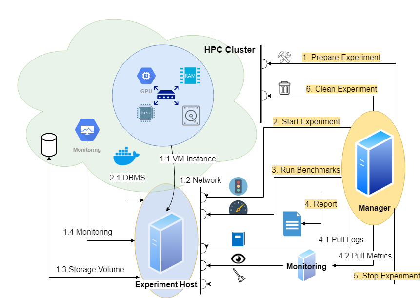

# Monitoring

To include monitoring you will need
* a Prometheus server scraping a fixed IP / Port
* a Grafana server collecting metrics from the Prometheus server
* some [configuration](#configuration) what metrics to collect

This document contains information about the
* [Concept](#concept)
* [Installation](#installation)
* [Configuration](#configuration)

## Concept

<p align="center">
    
</p>

There is
* an Experiment Host - this needs Prometheus exporters
* a Monitor - this needs a Prometheus server and a Grafana server scraping the Experiment Host
* a Manager - this needs a configuration (which metrics to collect and where from)

## Installation

To be documented

### Kubernetes

* Experiment Host: Exporters are part of the [deployments](Deployments.md)
* Monitor: Servers are deployed using Docker images, fixed on a separate monitoring instance
* Manager: See [configuration](#configuration)

### AWS

* Experiment Host: Exporters are deployed using Docker images, fixed on the benchmarked instance 
* Monitor: Servers are deployed using Docker images, fixed on a separate monitoring instance
* Manager: See [configuration](#configuration)

## Configuration

We insert information about
* the Grafana server
  * access token
  * URL
* the collection
  * extension of measure intervals
  * time shift
* metrics definitions

into the cluster configuration.
This is handed over to the [DBMS configuration](https://github.com/Beuth-Erdelt/DBMS-Benchmarker/blob/master/docs/Options.md#connection-file) of the [benchmarker](https://github.com/Beuth-Erdelt/DBMS-Benchmarker/blob/master/docs/Concept.md#monitoring-hardware-metrics) in a [monitoring section](https://github.com/Beuth-Erdelt/DBMS-Benchmarker/blob/master/docs/Options.md#monitoring).

### Example

The details of the metrics correspond to the YAML configuration of the [deployments](Deployments.md):
* `job="monitor-node"`
* `container_name="dbms"`


```
'monitor': {
    'grafanatoken': 'Bearer ABCDE==',
    'grafanaurl': 'http://localhost:3000/api/datasources/proxy/1/api/v1/',
    'grafanaextend': 20,
    'grafanashift': 0,
    'prometheus_url': 'http://localhost:9090/api/v1/',
    'metrics': {
        'total_cpu_memory': {
            'query': 'container_memory_working_set_bytes{{job="monitor-node", container_label_io_kubernetes_container_name="dbms"}}',
            'title': 'CPU Memory [MiB]'
        },
        'total_cpu_memory_cached': {
            'query': 'container_memory_usage_bytes{{job="monitor-node", container_label_io_kubernetes_container_name="dbms"}}',
            'title': 'CPU Memory Cached [MiB]'
        },
        'total_cpu_util': {
            'query': 'sum(irate(container_cpu_usage_seconds_total{{job="monitor-node", container_label_io_kubernetes_container_name="dbms"}}[1m]))',
            'title': 'CPU Util [%]'
        },
        'total_cpu_throttled': {
            'query': 'sum(irate(container_cpu_cfs_throttled_seconds_total{{job="monitor-node", container_label_io_kubernetes_container_name="dbms"}}[1m]))',
            'title': 'CPU Throttle [%]'
        },
        'total_cpu_util_others': {
            'query': 'sum(irate(container_cpu_usage_seconds_total{{job="monitor-node", container_label_io_kubernetes_container_name!="dbms",id!="/"}}[1m]))',
            'title': 'CPU Util Others [%]'
        },
        'total_cpu_util_s': {
            'query': 'sum(container_cpu_usage_seconds_total{{job="monitor-node", container_label_io_kubernetes_container_name="dbms"}})',
            'title': 'CPU Util [s]'
        },
        'total_cpu_throttled_s': {
            'query': 'sum(container_cpu_cfs_throttled_seconds_total{{job="monitor-node", container_label_io_kubernetes_container_name="dbms"}})',
            'title': 'CPU Throttle [s]'
        },
        'total_cpu_util_others_s': {
            'query': 'sum(container_cpu_usage_seconds_total{{job="monitor-node", container_label_io_kubernetes_container_name!="dbms",id!="/"}})',
            'title': 'CPU Util Others [s]'
        },
        'total_network_rx': {
            'query': 'sum(container_network_receive_bytes_total{{container_label_app="dbmsbenchmarker", job="monitor-node"}})',
            'title': 'Net Rx [b]'
        },
        'total_network_tx': {
            'query': 'sum(container_network_transmit_bytes_total{{container_label_app="dbmsbenchmarker", job="monitor-node"}})',
            'title': 'Net Tx [b]'
        },
        'total_fs_read': {
            'query': 'sum(container_fs_reads_bytes_total{{job="monitor-node", container_label_io_kubernetes_container_name="dbms"}})',
            'title': 'FS Read [b]'
        },
        'total_fs_write': {
            'query': 'sum(container_fs_writes_bytes_total{{job="monitor-node", container_label_io_kubernetes_container_name="dbms"}})',
            'title': 'FS Write [b]'
        },
        'total_gpu_util': {
            'query': 'sum(DCGM_FI_DEV_GPU_UTIL{{UUID=~"{gpuid}"}})',
            'title': 'GPU Util [%]'
        },
        'total_gpu_power': {
            'query': 'sum(DCGM_FI_DEV_POWER_USAGE{{UUID=~"{gpuid}"}})',
            'title': 'GPU Power Usage [W]'
        },
        'total_gpu_memory': {
            'query': 'sum(DCGM_FI_DEV_FB_USED{{UUID=~"{gpuid}"}})',
            'title': 'GPU Memory [MiB]'
        },
    }
}
```

#### Fine Tuning

If the Grafana server has metrics coming from general Prometheus server, that is it scrapes more exporters than just the bexhoma related, we will need to specify further which metrics we are interested in.

There is a placeholder `{gpuid}` that is substituted automatically by a list of GPUs present in the pod.

