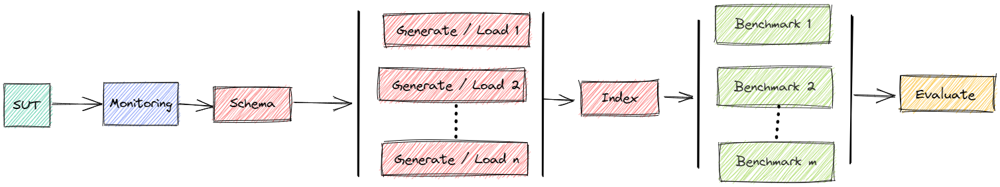
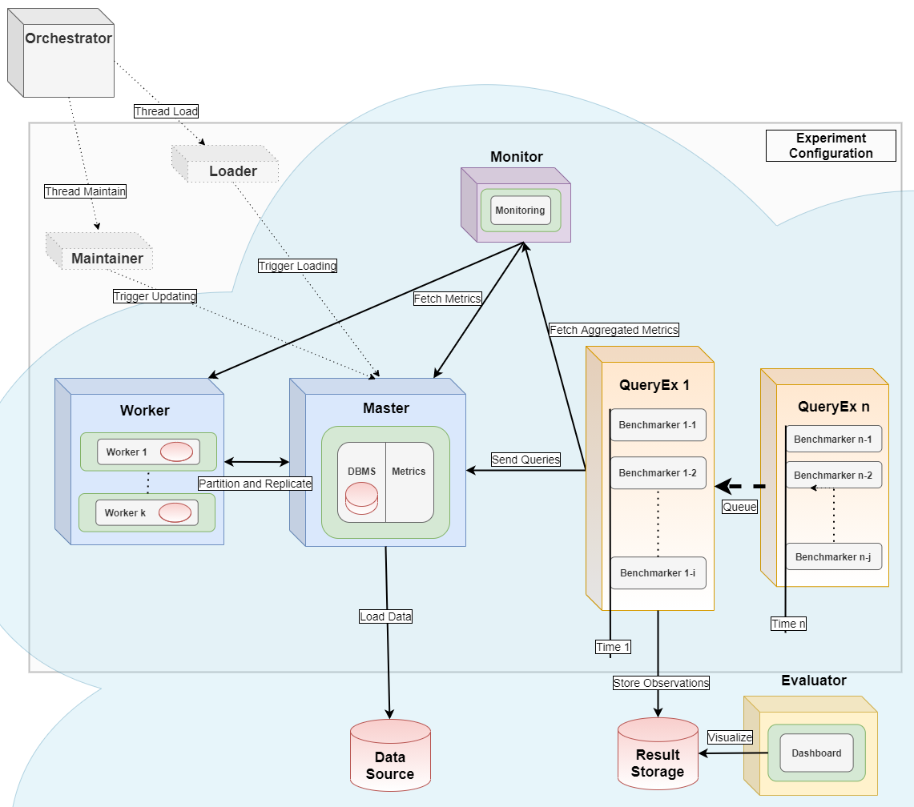

# Summary

Bexhoma (Benchmark Experiment Host Manager) is a Python tool that helps with managing benchmark experiments of Database Management Systems (DBMS) in a Kubernetes-based High-Performance-Computing (HPC) cluster environment. It enables users to configure hardware / software setups for easily repeating tests over varying configurations.

The basic workflow is [@10.1007/978-3-030-84924-5_6;@10.1007/978-3-030-94437-7_6]: start a containerized version of the DBMS, install monitoring software, import data, run benchmarks and shut down everything with a single command. A more advanced workflow is: Plan a sequence of such experiments, run plan as a batch and join results for comparison. It is possible to scale-out drivers for generating and loading data and for benchmarking to simulate cloud-native environments. Benchmarks included are YCSB, TPC-H, TPC-DS and TPC-C (HammerDB and Benchbase version).

{ width=1440}

Bexhoma serves as the orchestrator [@10.1007/978-3-030-94437-7_6] for distributed parallel benchmarking experiments in a Kubernetes Cloud. It starts a monitoring container of Prometheus and metrics collector containers of cAdvisor.
For analytical use cases, the Python package dbmsbenchmarker, [@Erdelt2022DBMSBenchmarker], is used as query executor and evaluator as in [@10.1007/978-3-030-84924-5_6;@10.1007/978-3-030-94437-7_6]. For transactional use cases, HammerDB's TPC-C, Benchbase's TPC-C and YCSB are used as drivers for generating and loading data and for running the workload as in [@10.1007/978-3-031-68031-1_9].

Bexhoma has been tested at Amazon Web Services, Google Cloud, Microsoft Azure, IBM Cloud, Oracle Cloud, and at Minikube installations, running with Clickhouse, Exasol, Citus Data (Hyperscale), IBM DB2, MariaDB, MariaDB Columnstore, MemSQL (SingleStore), MonetDB, MySQL, OmniSci (HEAVY.AI), Oracle DB, PostgreSQL, SQL Server, SAP HANA, TimescaleDB, and Vertica.

See the [homepage](https://github.com/Beuth-Erdelt/Benchmark-Experiment-Host-Manager) and the [documentation](https://bexhoma.readthedocs.io/en/latest/) for more details.

# Statement of Need

The first purpose of Bexhoma responds to the need for a framework to support all aspects of a benchmarking experiment.
In [@10.1007/978-3-319-67162-8_12] the authors present a cloud-centric analysis of eight evaluation frameworks.
In [@10.1007/978-3-030-12079-5_4] the authors inspect several frameworks and collect requirements for a DBMS benchmarking framework in an interview based method and per interest group.
In [@10.1007/978-3-319-15350-6_6] the authors list important components for benchmarking, like Benchmark Coordinator, Measurement Manager, Workload Executor. They plead for a benchmarking middleware to support the process, to "*take care of the hassle of distributed benchmarking and managing the measurement infrastructure*". This is supposed to help the benchmark designer to concentrate on the core competences: specifying workload profiles and analyzing obtained measurements. In [@10.1007/978-3-030-84924-5_6] we introduce the package based on the following extracted requirements:

* Help with time-consuming initial setup and configuration
* Metadata collection / Track everything
* Generality / Versatility
* Extensibility / Abstraction
* Usability / Configurability
* Repeatability / Reproducibility

The second purpose of Bexhoma targets the specific situation of cloud-native benchmarking.

## Similar approaches

Theodolite [@HENNING2021100209] for benchmarking stream processing engines.
Mowgli [@10.1145/3297663.3310303] aims at establishing Benchmarking-as-a-service.
Frisbee [@nikolaidis2021frisbeeautomatedtestingcloudnative] for declarative end-to-end system testing of containerized application.
KOBE [@10.1007/978-3-030-77385-4_40] for benchmarking federated query processors.


## Summary of Solution

* Virtualization with Docker containers
* Orchestration with Kubernetes
* Monitoring with cAdvisor / Prometheus, since it is a common practise in cluster management


{ width=1440}

* **SUT (DBMS)**: *deployment*, container `dbms`, container for cAdvisor for sidecar monitoring, *pvc* for persistent storage, *service* for connection, port 9091
* **Multi-host DBMS**: *statefulset* for worker, *job* for initialization
* **Monitoring**: *deployment* of Prometheus
* **Metrics collectors**: either sidecar of single-host DBMS or *daemonset* for all nodes of cluster.
* **Loader (schema and index creation)**: fire-and-forget thread in the orchestrator
* **Ingestion**: *job* of pods for data generation and for ingestion of data into the DBMS, synchronized using a Redis queue
* **Benchmarking**: *job* of pods for running the driver, synchronized using a Redis queue

# A Basic Example

The [documentation](https://bexhoma.readthedocs.io/en/latest/) contains a lot of examples.
We here show some basic examples for basic use cases.

## HammerDB's TPC-C at PostgreSQL

```
python hammerdb.py -ms 1 -tr \
  -sf 16 \
  -sd 5 \
  -dbms PostgreSQL \
  -nlt 16 \
  -nbp 1,2 \
  -nbt 16 \
  run
```

This

* starts a clean instance of PostgreSQL (`-dbms`)
  * data directory inside a Docker container
* starts 1 loader pod (per DBMS) that
  * creates TPC-C schema in the database
  * imports data for 16 (`-sf`) warehouses into the DBMS
  * using 16 (`-nlt`) threads
* runs streams of TPC-C queries (per DBMS)
    * running for 5 (`-sd`) minutes
    * each stream having 16 threads to simulate 16 users (`-nbt`)
    * `-nbp`: first stream 1 pods, second stream 2 pods (8 threads each)
* with a maximum of 1 DBMS per time (`-ms`)
* tests if results match workflow (`-tr`)
* shows a summary

### Experiment Status

You can watch the status while benchmark is running via `bexperiments status`

```
Dashboard: Running
Cluster Prometheus: Running
Message Queue: Running
Data directory: Running
Result directory: Running
+---------------------+--------------+-------------+---------------+-------------+
| 1726578005          | sut          |  loaded [s] | use case      | loading     |
+=====================+==============+=============+===============+=============+
| PostgreSQL-BHT-16-1 | (1. Running) |           1 | hammerdb_tpcc | (1 Running) |
+---------------------+--------------+-------------+---------------+-------------+
```

The code `1726578005` is the unique identifier of the experiment.
You can find the number also in the output of `hammerdb.py`.

### Experiment Results

At the end of a benchmark you will see a summary like

```
## Show Summary

### Workload
HammerDB Workload SF=16 (warehouses for TPC-C)
    Type: tpcc
    Duration: 1205s 
    Code: 1726578005
    This includes no queries. HammerDB runs the benchmark
    This experiment compares run time and resource consumption of TPC-C queries in different DBMS.
    TPC-C data is generated and loaded using several threads.
    Scaling factor (i.e., number of warehouses) is 16. Benchmarking runs for 5 minutes.
    Benchmark is limited to DBMS PostgreSQL.
    Import is handled by 1 processes (pods).
    Loading is fixed to cl-worker19.
    Benchmarking is fixed to cl-worker19.
    SUT is fixed to cl-worker11.
    Loading is tested with [16] threads, split into [1] pods.
    Benchmarking is tested with [16] threads, split into [1, 2] pods.
    Benchmarking is run as [1] times the number of benchmarking pods.
    Experiment is run once.

### Connections
PostgreSQL-BHT-16-1-1 uses docker image postgres:16.1
    RAM:541008605184
    CPU:AMD Opteron(tm) Processor 6378
    Cores:64
    host:5.15.0-116-generic
    node:cl-worker11
    disk:252347764
    datadisk:3377044
    requests_cpu:4
    requests_memory:16Gi
PostgreSQL-BHT-16-1-2 uses docker image postgres:16.1
    RAM:541008605184
    CPU:AMD Opteron(tm) Processor 6378
    Cores:64
    host:5.15.0-116-generic
    node:cl-worker11
    disk:253279924
    datadisk:4309204
    requests_cpu:4
    requests_memory:16Gi

### Execution
                       experiment_run  vusers  client  pod_count     NOPM      TPM  duration  errors
PostgreSQL-BHT-16-1-1               1      16       1          1  12247.0  37509.0         5       0
PostgreSQL-BHT-16-1-2               1      16       2          2  10391.0  31969.5         5       0

Warehouses: 16

### Workflow

#### Actual
DBMS PostgreSQL-BHT-16-1 - Pods [[1, 2]]

#### Planned
DBMS PostgreSQL-BHT-16-1 - Pods [[1, 2]]

### Loading
                       time_load  terminals  pods  Imported warehouses [1/h]
PostgreSQL-BHT-16-1-1       84.0        1.0   1.0                 685.714286
PostgreSQL-BHT-16-1-2       84.0        1.0   2.0                 685.714286

### Tests
TEST passed: NOPM contains no 0 or NaN
TEST passed: Workflow as planned
```

We can see that scaled-out drivers (2 pods with 8 threads each) have similar results as a monolithic driver (1 pod with 16 threads) - but are a bit weaker.

To see the summary again you can simply call `bexperiments summary -e 1726578005` with the experiment code.

# Acknowledgements


# References
